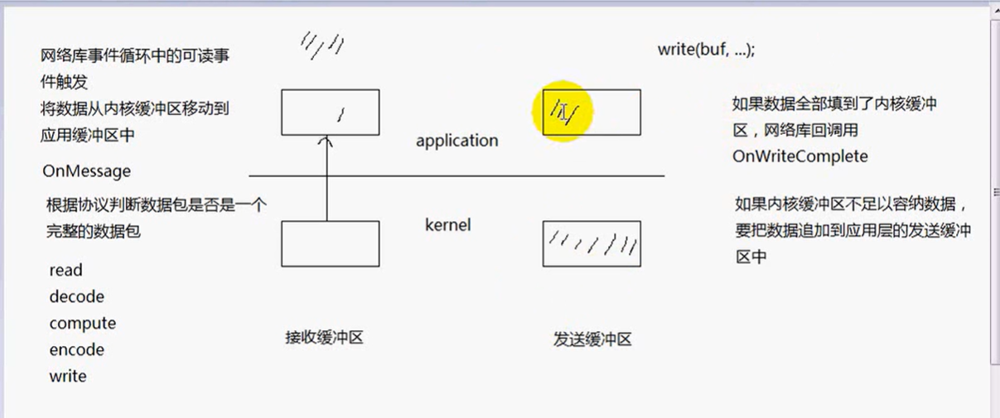
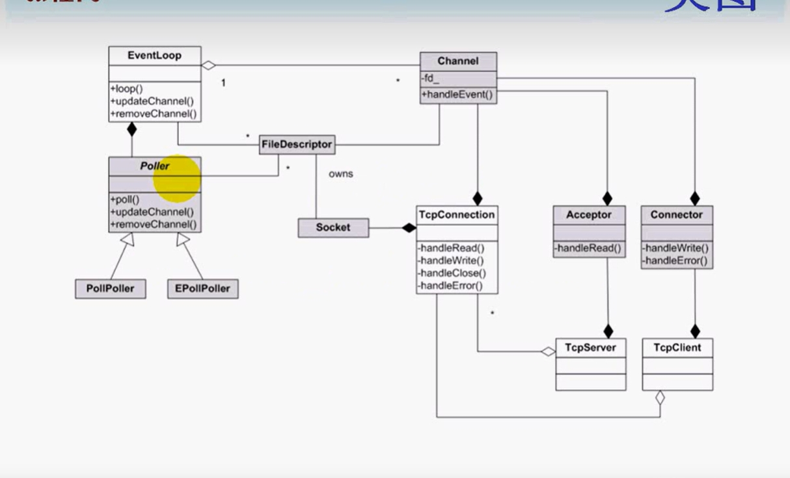
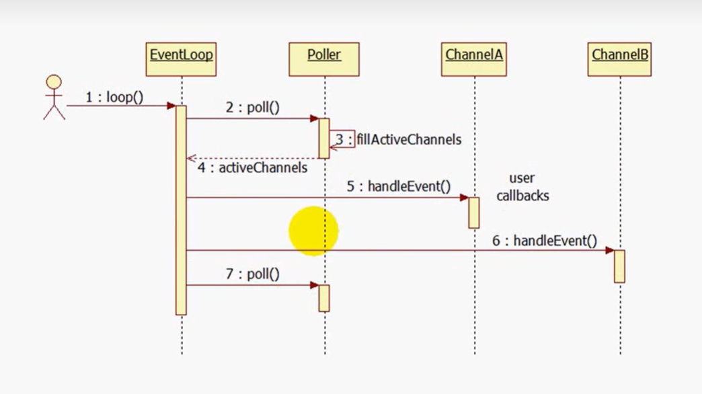
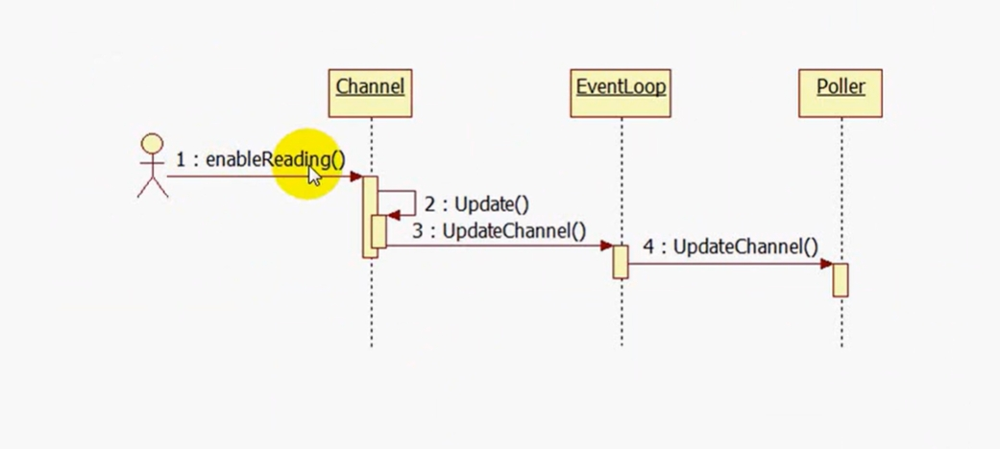
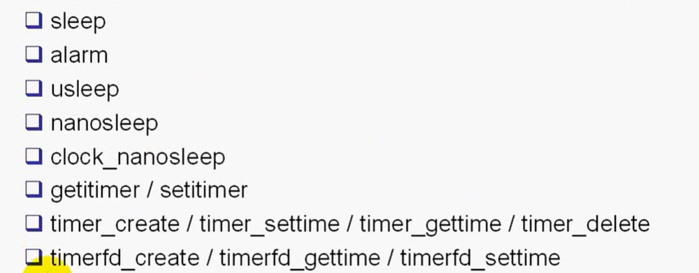
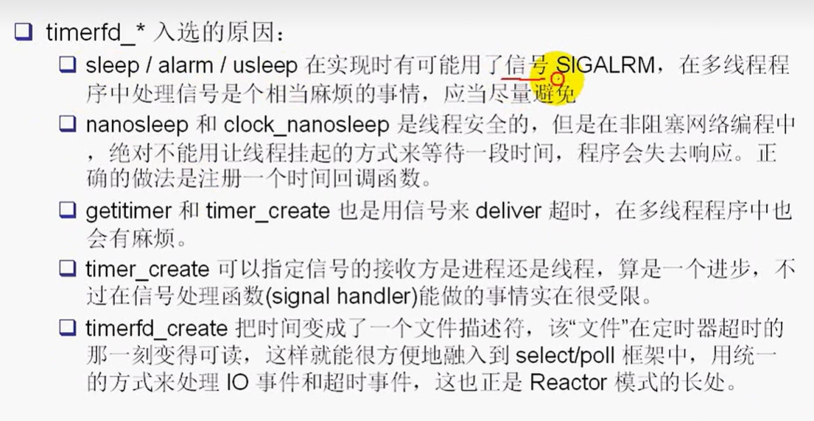
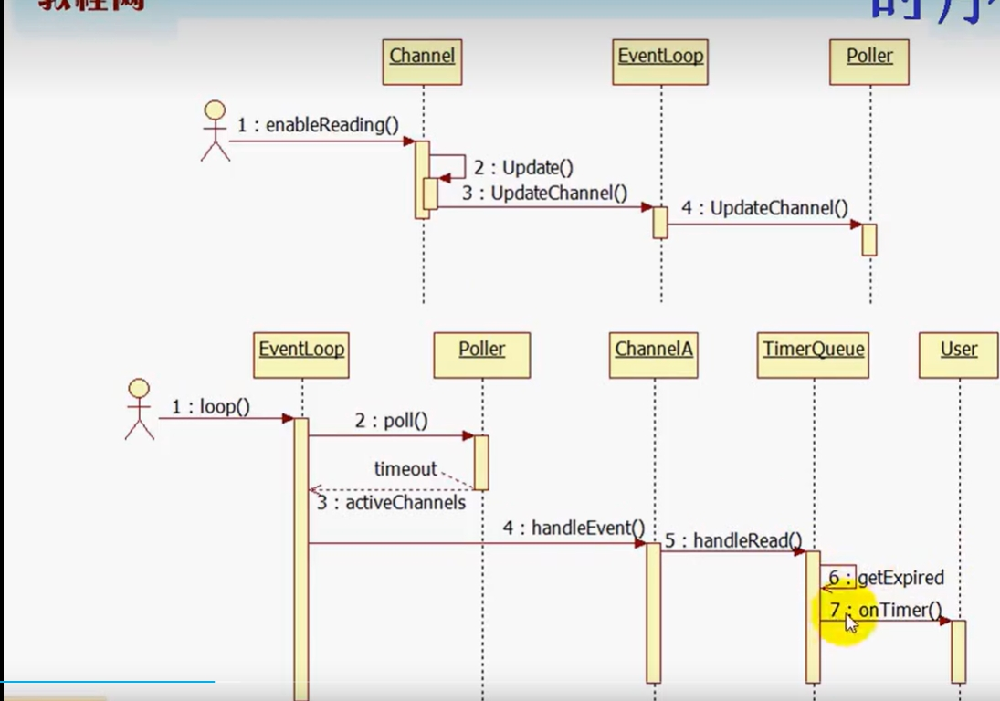

# muduo_net

## 要处理三个半事件

- 连接建立：服务端的accept，发送端的connect
- 连接断开：主动断开的的close和shutdown，以及被动断开（read函数返回为0）
- 消息到达：文件描述符可读
- 消息发送完毕：对于低流量的服务可以不用担心这个事件。数据写入操作系统的缓冲区，由tcp的协议栈负责数据的发送和重传，不代表对方已经收到数据

muduo网络库提供了3个注册的回调函数来处理这些事件。**连接建立和断开，消息到达，发送发送完成**

## muduo网络库的组成结构

- 白色部分是外部类，对外部是可见的，灰色部分是内部类，对外部不可见
- eventloop是对事件循环的抽象
- poller是对io复用的抽象，他有两个派生类一个是poll一个是epoll：用两个不同的机制实现io复用：是muduo唯一用面向对象思想来封装的类
- 黑色实心代表==组合==，Poller的生存期由eventloop来控制
- 点代表一对多，eventloop可以捕捉多个channel的可读可写事件，一个eventloop有多个文件描述符，一个channel只有一个文件描述符（而且这个由还是关联关系，不会影响这个文件描述符）
- 文件描述符由socket套接字类来控制，想想也不难理解，套接字关闭了文件描述符自然也就销毁了。
- channel：对io事件注册与相应的封装（注册可读，可写）
- 来一个连接，tcpserver就生成一个tcpconncet，可以建立多个连接，tcpclient就只能建立一个了
- 因为可以存在单方面断开连接的情况，所以connect生命不由server和clinet控制

## 循环逻辑

### 1. loop函数的时序图

### 2. 注册事件的时序图

在poll（返回活动的通道）之前要注册事件

## **c++类之间的五大关系**

1. **依赖（Dependency）**：一个类的实现依赖于另一个类的实现，但它们之间的关系较短暂。一个类的变化可能会影响到另一个类。只是用到了这个类而已。
2. **关联（Association）**：两个类之间的关系，表示一个类的对象与另一个类的对象有关联。关联可以是单向或双向的，可以是强关联或弱关联。这个类有另一个类的成员变量。
3. **聚合（Aggregation）**：表示整体与部分之间的关系，是一种弱的拥有关系。一个对象可以包含另一个对象，但它们的生命周期可以是独立的。
4. **组合（Composition）**：是一种更强烈的拥有关系，表示一个对象包含另一个对象，并且其生命周期与整体对象的生命周期相同。
5. **继承（Inheritance）**：表示一个类（子类/派生类）从另一个类（基类/父类）继承属性和行为。继承建立了"is-a"关系。

==因为网络模块很负责相关代码笔记直接看我在源码中的批注==

 ## EventLoop：事件循环

我只会在这里记录一些我觉得很实用的功能：

### 1. 中断loop循环

这里用`quit()`函数来修改标志位`bool quit`来终端`loop()`函数的`while`循环，但是如果此时loop函数正处在阻塞状态怎么办？

这个问题其实现实中很常见，你阻塞等待一个文件描述符，但是这时候突然要你停止等待，你又处在阻塞状态收不到消息，怎么办？

**方案1：管道监听**：

你监听指定文件描述符的时候，==额外监听一个管道的文件描述符==你可以通过管道激活处在阻塞的线程，然后通知他结束掉这个线程。

**方案2：eventfd**：

## Channel

## PollPoller

## 定时器事件

这些都是可以实现定时器的功能，我们选择的是最后一个

多线程的程序应该尽量避免用信号.我在异常操作汇聚系统也是用的这一个定时器。记得详细说明一下设计思路。

### 定时器工作时序图

