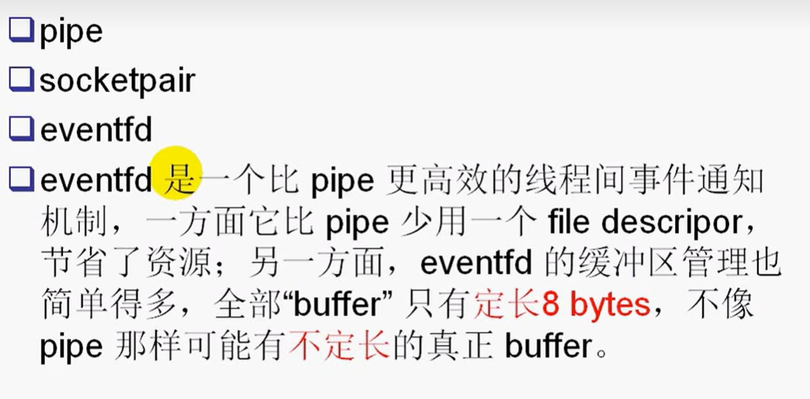
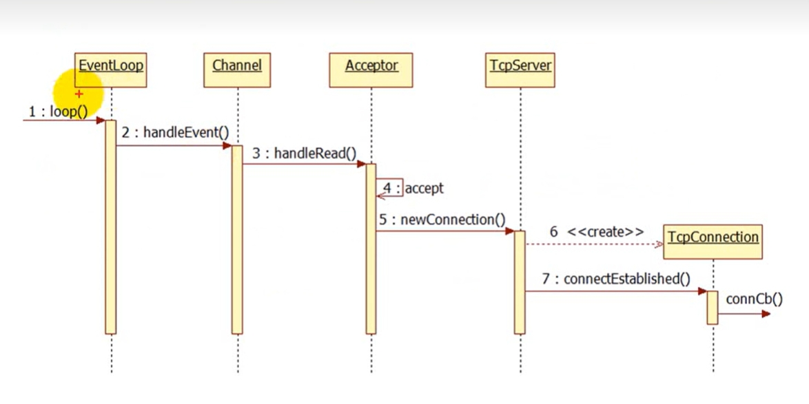
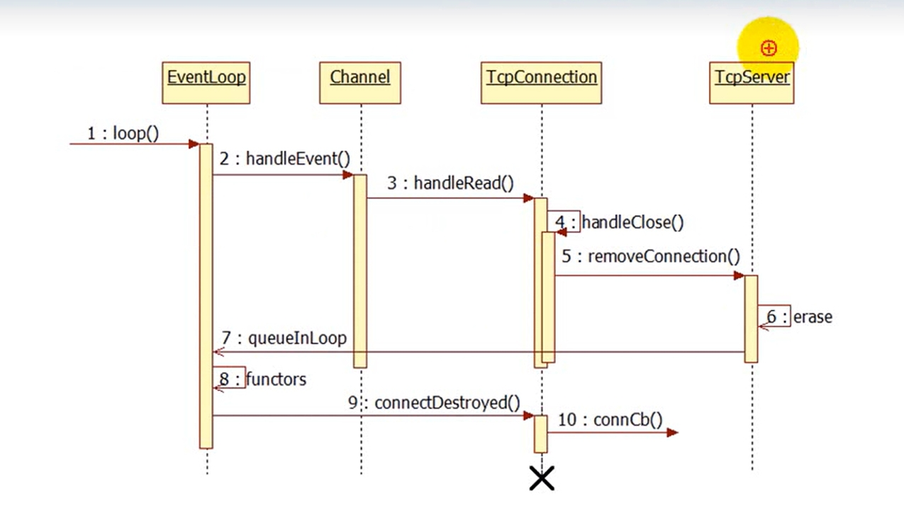
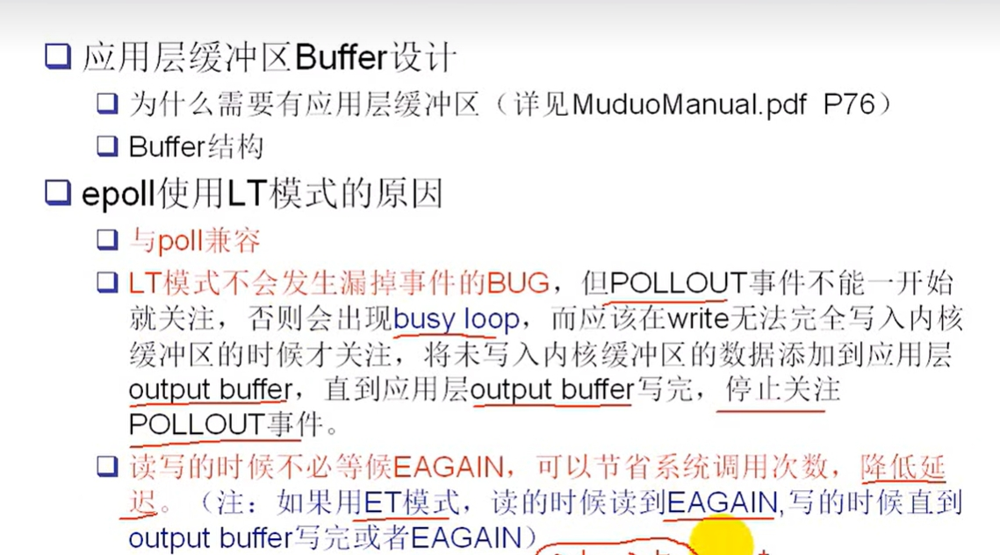

# muduo_net

## 要处理三个半事件

- 连接建立：服务端的accept，发送端的connect
- 连接断开：主动断开的的close和shutdown，以及被动断开（read函数返回为0）
- 消息到达：文件描述符可读
- 消息发送完毕：对于低流量的服务可以不用担心这个事件。数据写入操作系统的缓冲区，由tcp的协议栈负责数据的发送和重传，不代表对方已经收到数据

muduo网络库提供了3个注册的回调函数来处理这些事件。**连接建立和断开，消息到达，发送发送完成**

## muduo网络库的组成结构

- 白色部分是外部类，对外部是可见的，灰色部分是内部类，对外部不可见
- eventloop是对事件循环的抽象
- poller是对io复用的抽象，他有两个派生类一个是poll一个是epoll：用两个不同的机制实现io复用：是muduo唯一用面向对象思想来封装的类
- 黑色实心代表==组合==，Poller的生存期由eventloop来控制
- 点代表一对多，eventloop可以捕捉多个channel的可读可写事件，一个eventloop有多个文件描述符，一个channel只有一个文件描述符（而且这个由还是关联关系，不会影响这个文件描述符）
- 文件描述符由socket套接字类来控制，想想也不难理解，套接字关闭了文件描述符自然也就销毁了。
- channel：对io事件注册与相应的封装（注册可读，可写）
- 来一个连接，tcpserver就生成一个tcpconncet，可以建立多个连接，tcpclient就只能建立一个了
- 因为可以存在单方面断开连接的情况，所以connect生命不由server和clinet控制

## 循环逻辑

### 1. loop函数的时序图

### 2. 注册事件的时序图

在poll（返回活动的通道）之前要注册事件

## **c++类之间的五大关系**

1. **依赖（Dependency）**：一个类的实现依赖于另一个类的实现，但它们之间的关系较短暂。一个类的变化可能会影响到另一个类。只是用到了这个类而已。
2. **关联（Association）**：两个类之间的关系，表示一个类的对象与另一个类的对象有关联。关联可以是单向或双向的，可以是强关联或弱关联。这个类有另一个类的成员变量。
3. **聚合（Aggregation）**：表示整体与部分之间的关系，是一种弱的拥有关系。一个对象可以包含另一个对象，但它们的生命周期可以是独立的。
4. **组合（Composition）**：是一种更强烈的拥有关系，表示一个对象包含另一个对象，并且其生命周期与整体对象的生命周期相同。
5. **继承（Inheritance）**：表示一个类（子类/派生类）从另一个类（基类/父类）继承属性和行为。继承建立了"is-a"关系。

==因为网络模块很负责相关代码笔记直接看我在源码中的批注==

 ## EventLoop：事件循环

我只会在这里记录一些我觉得很实用的功能：

### 1. 中断loop循环

这里用`quit()`函数来修改标志位`bool quit`来终端`loop()`函数的`while`循环，但是如果此时loop函数正处在阻塞状态怎么办？

这个问题其实现实中很常见，你阻塞等待一个文件描述符，但是这时候突然要你停止等待，你又处在阻塞状态收不到消息，怎么办？

**方案1：管道监听**：

你监听指定文件描述符的时候，==额外监听一个管道的文件描述符==你可以通过管道激活处在阻塞的线程，然后通知他结束掉这个线程。

**方案2：eventfd**：我在下面有说明

### 2. 函数queueInLoop和runInLoop的理解很精彩

就是在相同的线程中和在不同的线程中给loop添加回调函数，你要怎么处理才能不出错，里面有很多的知识点。

比如说用到了终端阻塞状态，同线程的直接运行，不同线程的用安全的回调队列。在执行回调函数的过程中又有新的回调被添加应该怎么处理

## Channel

## PollPoller

 

## 定时器事件：timer， timerqueue， timerid

这些都是可以实现定时器的功能，我们选择的是最后一个

多线程的程序应该尽量避免用信号.我在异常操作汇聚系统也是用的这一个定时器。记得详细说明一下设计思路。

### 定时器的原理

1. 设置一个定时器类，包括超时事件，是否重复等
2. 将这个定时器对象放入一个定时器的容器里面，这个容器实时根据现在的时间检测容器中存放的定时器是否已经过期了

### 定时器工作时序图

## 一个线程如何通知另一个等待中的线程：loop中的唤醒机制

我之前说过一个问题，你想结束一个线程的等待，但是这个线程目前在阻塞状态，你如何将这个线程唤醒呢，现在我们来解决这个问题：

进程间也可以用这个：

- pipe：单向通信

- socketpair：是双向通信，看名字就看出来，是基于socket套接字实现的

- eventfd：如图所示

以上都有**文件描述符**，所以可以用epoll模型来处理

此外线程间还可以用==条件变量==

## EventloopThread

muduo是一个io线程一个loop,所以可以有多个io线程,多个io线程可以用io线程池来管理,这个类用来封装io线程

功能：

1. 创建也给线程

2. 在该线程中创建一个loop对象，并让该对象处于loop状态

## EventloopThreadPool

开启若干个IO线程，并让这些IO线程处于事件循环状态

## socket

### Endian.h模块

封装了字节序转换的相关函数

### SocketOps模块

对socket相关的系统调用进行RAII封装。全局函数

### socket模块

封装了socket的文件描述符

### InetAddress

对网络地址操作的封装

## Accepttor

有两个主要的数据成员

- Socket套接字：主要是服务器端套接字，即server socket
- channel： 用于观察socket的可读事件，并用于回调socket的可读事件，回调的内容就是建立连接

主要作用是

- 保存socket的文件描述符
- 绑定socketfd
- 监听socketfd
- 处理监听回调：建立连接（回调的执行是channel，执行的回调是Acceptor写的，写的是接收连接）
- 回调用户的回调函数：在连接建立成功的时候调用回调（回调的执行者是Acceptor，执行的回调是应用层写的。具体看上面怎么处理接受的连接）

## TcpServer & TcpConnection

### TcpServer

含有的主要成员：

- Acceptor成员（收到连接后会建立连接，将建立的socket信息通过回调传递给TcpServer ）
- TcpConnection列表：（Acceptor创建完连接够回调函数，创建了TcpConnection）

### TcpConnection

##### 主要成员：

- Socket：主要是服务器端套接字，即server socket
- Chennel： 用于观察socket的可读可写事件

#### 生存期管理

### 连接建立时序图

### 连接关闭时序图

这里想一下==为什么不能直接在第六步就销毁这个tcpconnection==：

因为tcpconnection中有channel，此时channel正在等待回调函数的返回呢，你把他销毁了，等回调逐层返回的时候，直接就段错误了

所以==如何管理Tcpconnection的生命周呢？==

> 用智能指针：当连接到来，创建一个TcpConnection对象，立刻用share_ptr来管理，引用技术为1
>
> 在Channel中维护一个weak_ptr(tie),将share_ptr对象赋值给tie,引用计数仍然为1
>
> 当连接关闭，在handleEvnt中，将tie提升，得到一个share_ptr对象，引用计数就变成了2
>
> 这时候执行第六步，引用技术减一，就剩下了1，还不会销毁对象
>
> 进行下一次循环的时候，进行connetDestoryed函数的工作，开始销毁Channel，销毁方法运行完之后，引用计数为0，自动回收Tcpconncetion，连接也就彻底的关闭了

## 应用缓冲区Buffer的设计

**为什么要在应用层设计buffer缓冲区**

请看MuduoManual.pdf中的2.4.2，这个是非常正确的，平时设计服务器程序的时候几乎没有考虑过发送缓冲区的问题，默认发送缓冲区是充足的。其实不然，受到滑动窗口的限制，==大流量==应用程序，会不断的产生数据发送，如果接收端接收不及时，滑动窗口会变小。有时候发送缓冲区并不会很大，这个时候就要将没发送的数据暂存到应用层的发送缓冲区中，等待pollout事件的触发，然后在写入数据才可以。

对读缓冲区，当有数据写入应用层的读缓冲区的时候，我们应该通知用户，用用户提供的回调函数来检查，这些应用层的数据是否符合我们的格式需求，如果不符合我们不用改使用这些数据，只有数据满足我们用户的协议，我们才会取走。

## Connector

用来主动的发起连接，带有自动重连的功能

## TcpClinet

包含一个connector对象
