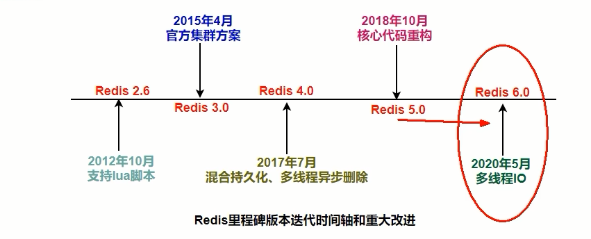
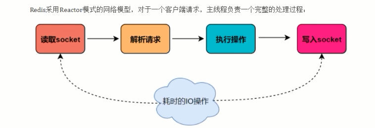
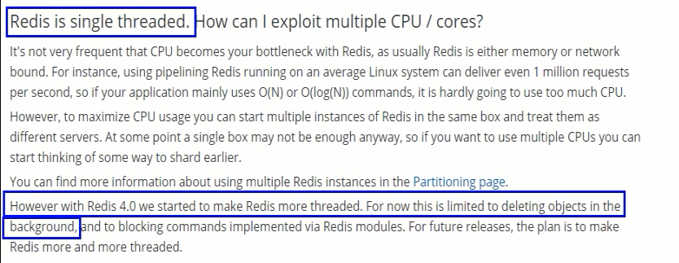
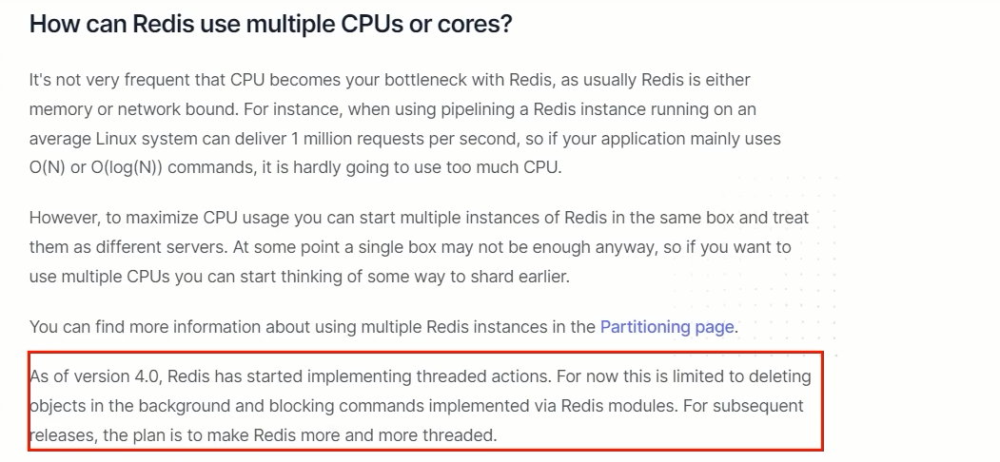

# Redis为什么选择单线程

### 是什么？

$\textcolor{blue}{\large 这种问法其实并不严谨，为啥这么说呢？}$

```tex
Redis的版本很多3.x、4.x、6.x，版本不同架构也是不同的，不限定版本问是否单线程也不太严谨。
1 版本3.x ，最早版本，也就是大家口口相传的redis是单线程。
2 版本4.x，严格意义来说也不是单线程，而是负责处理客户端请求的线程是单线程，但是开始加了点多线程的东西(异步删除)。---貌似
3 2020年5月版本的6.0.x后及2022年出的7.0版本后，告别了大家印象中的单线程，用一种全新的多线程来解决问题。---实锤
```

 有几个里程碑式的重要版本



5.0版本是直接升级到6.0版本，对于这个激进的升级，Redis之父antirez表现得很有信心和兴奋，所以第一时间发文来阐述6.0的一些重大功能”Redis 6.0.0 GA is out!” 

 当然，Redis7.0后版本更加厉害

### why，为什么之前选择单线程

理清一个事实，通常说，Redis是单线程究竟何意？

Redis是单线程主要是指Redis的网络IO和键值对读写是由一个线程来完成的，Redis在处理客户端的请求时包括获取(socket 读)、解析、执行、内容返回(socket 写) 等都由一个顺序串行的主线程处理，这就是所谓的“单线程”。这也是Redis对外提供键值存储服务的主要流程。



但Redis的其他功能，比如持久化RDB、AOF、异步删除、集群数据同步等等，其实是由额外的线程执行的。Redis 命令工作线程是单线程的，但是，整个Redis来说，是多线程的；

 请说说演进变化情况

Q：Redis3.X单线程时代但是性能依旧很快的主要原因？

A：

基于内存操作: Redis 的所有数据都存在内存中，因此所有的运算都是内存级别的，所以他的性能比较高；
数据结构简单:Redis 的数据结构是专门设计的，而这些简单的数据结构的查找和操作的时间大部分复杂度都是 0(1)，因此性能比较高；

多路复用和非阻塞 I/O: Redis使用  I/O多路复用功能来监听多个 socket连接客户端，这样就可以使用一个线程连接来处理多个请求，减少线程切换带来的开销，同时也避免了 I/O 阻塞操作； 

避免上下文切换:因为是单线程模型，因此就避免了不必要的上下文切换和多线程竞争，这就省去了多线程切换带来的时间和性能上的消耗，而且单线程不会导致死锁问题的发生


### 作者原话使用单线程原因，官网证据

官网：https://redis.io/docs/getting-started/faq/

旧版本Redis官网说明，说Redis就是单线程

**Redis是单线程的。如何利用多个CPU /内核?**
CPU并不是您使用Redis的瓶颈，因为通常Redis要么受内存限制，要么受网络限制。例如，使用在平均Linux系统上运行的流水线Redis每秒可以发送一百万个请求，因此，如果您的应用程序主要使用O(N)或O(log(N) )命令，则几乎不会使用过多的CPU。

但是，为了最大程度地利用CPU，您可以在同一框中启动多个Redis实例，并将它们视为不同的服务器。在某个时候，单个盒子可能还不够，因此，如果您要使用多个CPU，则可以开始考虑更早地进行分片的某种方法。您可以在“分区”页面中找到有关使用多个Redis实例的更多信息。

但是，在Redis 4.0中，我们开始使Redis具有更多线程，目前，这仅限于在后台删除对象，以及阻正通过Redis模块实现的命令。对于将来的版本，计划是使Redis越来越线程化。

他的大体意思是说 Redis 是基于内存操作的，因此他的瓶颈可能是机器的内存或者网络带宽而并非 CPU，既然 CPU 不是瓶颈，那么自然就采用单线程的解决方案了，况且使用多线程比较麻烦。 但是在 Redis 4.0 中开始支持多线程了，例如后台删除、备份等功能。

新版本Redis官网原话，去掉了单线程的

一直采用单线程的主要原因有以下三个

1. 使用单线程模型是 Redis 的开发和维护更简单，因为单线程模型方便开发和调试;
2. 即使使用单线程模型也并发的处理多客户端的请求，主要使用的是IO多路复用和非阻塞IO；
3. 对于Redis系统来说，主要的性能瓶颈是内存或者网络带宽而并非 CPU。


