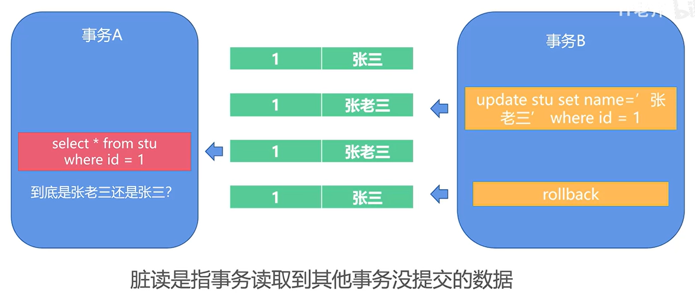
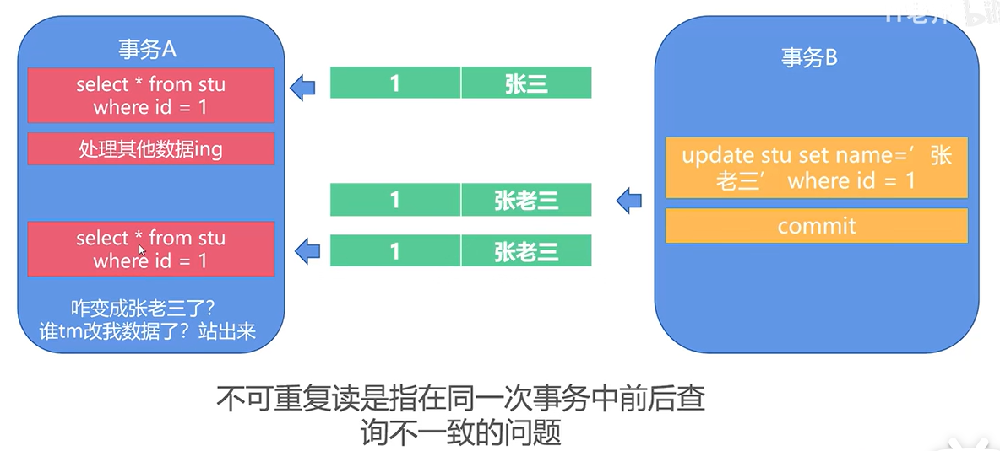
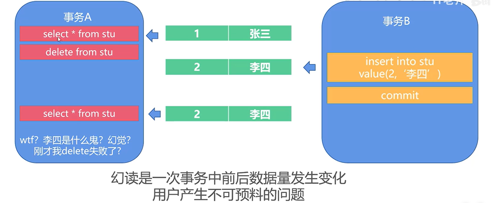
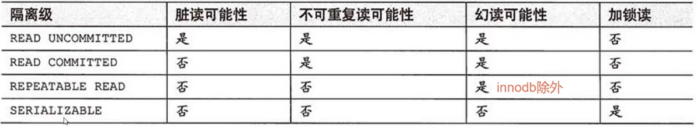
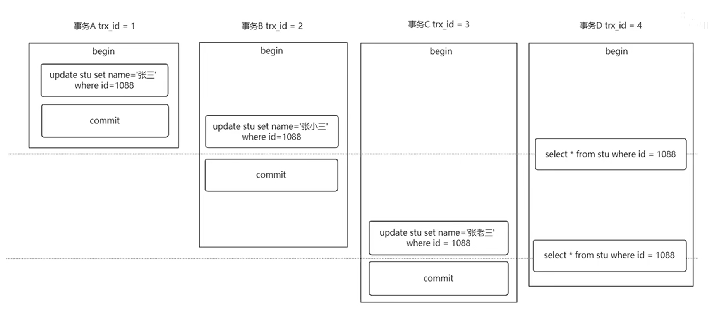
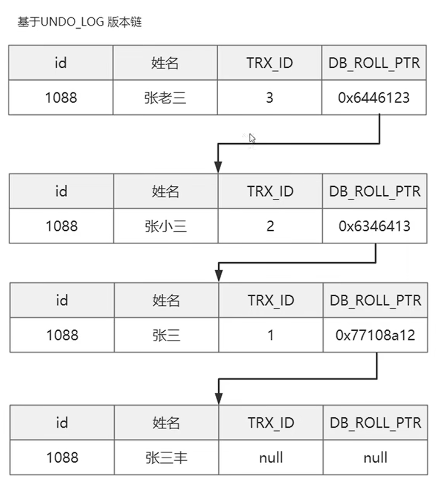
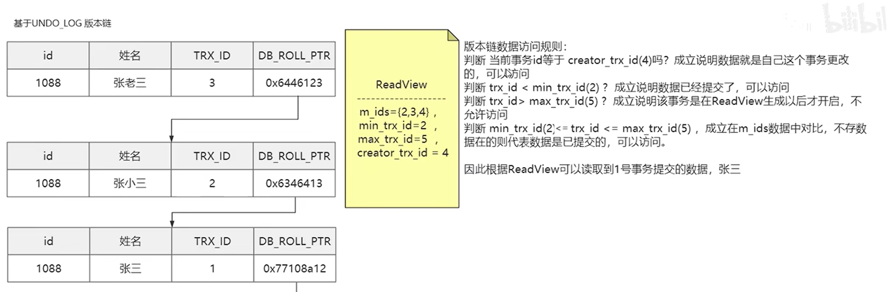
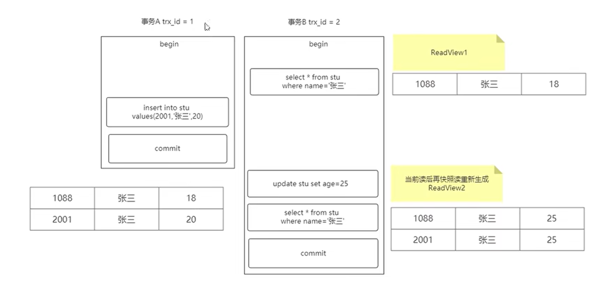

## 脏读，幻读，不可重复读

1. 脏读：读取到了其他事务没有提交的数据。

   

2. 不可重复读：在同一次事务中，前后查询到的数据是不一样的。 （其他事务修改数据引起的）

3. 幻读：一次事务中，前后数据不一样数量发生了变化（和不可重复读产生的原因不一样，这是因为幻读产生的原因是其他事务数据插入引起的）

## 事务隔离级别

1. 读未提交

2. 读以提交

3. 可重复读（默认的隔离级别）

4. 可串行读读

   

## MVCC的实现

mvcc用在读以提交和可重复读两个隔离级别下的。原理是基于数据版本对并发事务进行访问。

**看一个例子：**

**问题：在不同的隔离级别下，都读到什么内容？**

> - 读未提交：张小三，张老三（脏读：读到了没有提交的数据）
> - 读已提交：张三，张小三（不可重复读：同一个语句返回的结果不同）
> - 可重复读：张三，张三（没有问题）

**mvcc是基于undolog的版本链实现的**：

- trx_id:事务号
- db_poll_ptr:上一次版本变化的更新内容

**问题：undolog不是会被删除吗？如果中间的链条被删除了版本链不就断了吗？**

> undolog不是立刻删除的，mysql确保版本链数据不被并行事务引用后在进行删除

**快照读和当前读：**

- 快照读(MVCC)：sql执行时mvcc提取数据的依据，最普通的查询语句就是用的快照读。
- 当前读(行锁，间隙锁)：执行下列语句时进行的读取最新数据的方式:insert,update,delete,select...for update,select... lock in share mode

**读视图ReadView：**

它是一个数据结构，包含了4个字段

- m_ids:当前活跃的事务编号集合
- min_trx_id:最小活跃的事务编号
- max_trx_id:预分配事务编号，当前最大事务编号+1
- creator_trx_id:ReadView创建者的事务编号

1. 读已提交：在每一次执行快照读的时候都会生成ReadView。

2. 可重复读：只有第一次快照读的时候才会生成一份ReadView。在当前读的时候才会重新生成ReadView。

   所以：==当两次快照读之间存在当前读，readView会重新生成，就会导致幻读问题==，这里只能是插入操作，因为更新操作会被锁锁住，不会出现不可重复读的情况，但是锁锁不住插入语句。插入了之后就会出现了幻读，结果集出现了变化。

