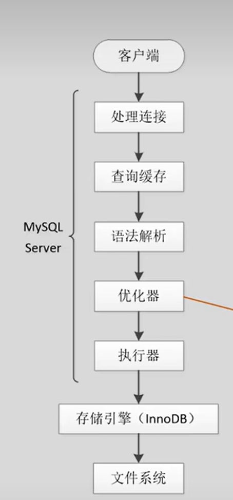
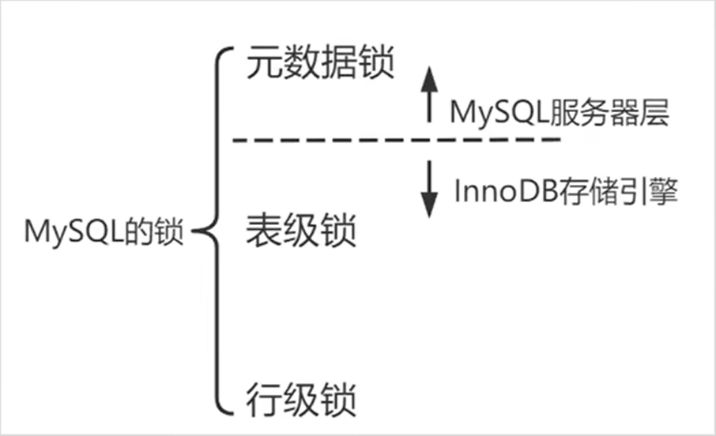
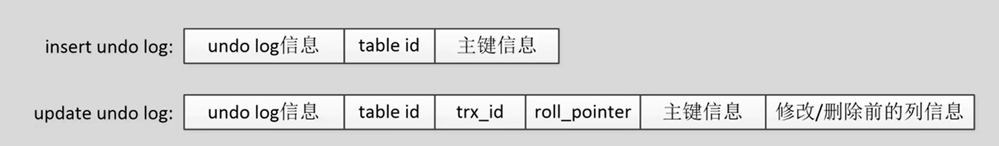
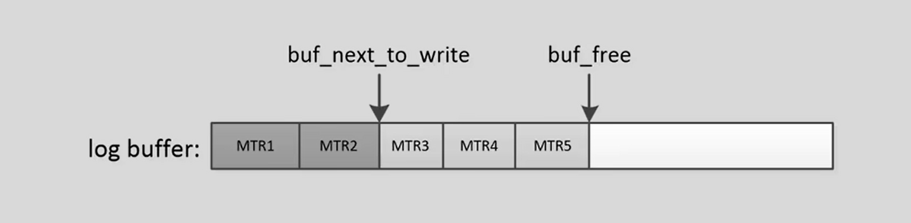

[TOC]

```mysql

start transaction;
update biliblili set status='关注' where ip = 20;
commit;
```

先写一个基础目录，大概有一个路线：

- 开启事务
- sql解析，查询计划的生成
- 查询要修改的数据
- 校验锁和加锁
- 修改数据和生成日志
- 本地提交
- 主备复制
- 返回提交成功
- 脏页刷入磁盘


## 1. 开启事务

 无论你是否主动开启了事务，innodb都会给你开启一个事务，在最后完成时自动或者主动提交

无论那种方式开启事务，**muydql都会在事务第一次执行增删改查的操作时，给事务分配一个事务号**，假定我们的事务号是1024

## 2. Sql解析，查询计划生成



1. 解析查询（SQL Parsing）：当 MySQL 接收到查询语句时，首先会对查询进行解析，生成解析树。
2. 优化查询：优化器会决定如何执行查询，选择最佳的索引和访问路径。
3. 使用索引定位数据页：假设 `id` 是主键或有索引，InnoDB 会利用 B+ 树索引来定位具体的数据页。

往后就不是服务层该关心的问题了

## 3. 查询要修改的数据

在更新之前，InnoDB 会读取要修改的行。这一步是必要的，因为需要确保找到所有符合条件的行，并且在更新之前需要生成旧数据的快照以用于日志记录和回滚操作。

这时候就要设计==buffer pool + 磁盘==了，我们查询需要 ==表空间号+页号== 才能定位到我们想要查询的数据

1. **确定目标页**：
   
   - 解析 SQL 语句，找到表 `biliblili` 的表空间 ID。
   - 根据索引（假设 `ip` 字段是主键），确定包含 `ip= 20` 的数据页的页号。
   
   **你如何获取表空间号和页号？**
   
   1. 解析查询（SQL Parsing）：当 MySQL 接收到查询语句时，首先会对查询进行解析，生成解析树。
   2. 优化查询：优化器会决定如何执行查询，选择最佳的索引和访问路径。
   3. 使用索引定位数据页：假设 `id` 是主键或有索引，InnoDB 会利用 B+ 树索引来定位具体的数据页。
   4. 每个表在创建时，都会在数据字典中记录其表空间 ID。这是 InnoDB 系统表的一部分。可以通过查询 `INFORMATION_SCHEMA.INNODB_SYS_TABLES` 来查看表的表空间 ID
   
   
   
2. **在 Buffer Pool 中查找**：
   - 组合表空间 ID 和页号，作为哈希表（注意了，这里有hash表）的键。
   
   - 在哈希表中查找是否有这个键对应的数据页。
   
     **在 InnoDB 中，数据是按照页（page）来存储和管理的，页是最小的存储和访问单元。即使在索引中找到了一行数据的指针，实际的数据存储仍然在页中，访问数据行需要读取包含该行的整个数据页。**
   
3. **返回结果**：
   
   - 如果找到，则直接从 Buffer Pool 读取数据并返回。
   - 如果没有找到，则从磁盘读取相应的数据页到 Buffer Pool，然后返回数据。

## 4. 校验锁和加锁



我们这个修改语句会申请独占锁来保证数据的一致性。（默认是可重复读的隔离级别）

1. 首先在服务器层获取元数据读锁

   如果申请的时候有DDl语句，正在修改这个表的表结构，就会阻塞到这里

2. 然后在引擎层上意向排他锁

3. 最后上行级锁，排他锁

   如果上面有其他事务上的锁的话，这里也会阻塞

## 5. 修改数据和生成日志

上锁之后，可以安全的对我们查到的内容进行数据的修改操作了

这一步我们要写3部分内容

- 数据页（缓冲页）
- undolog
- redolog

1. 缓冲页

   - 如果修改这行数据的大小没有变化----->就地更新
   - 任何字段的大小发生了变化------>插入------>插入一条新纪录

   我们这个修改的是vchar明显的是改变了大小，我们会插入一条新的记录，旧的我们会当作垃圾页删除，如果在这个时候插入的内容过大还会触发页分裂。**在buffer中，我们会将这个页连接在Flush list中，LRU的位置也会往前提**。

2. undo log

   - undo log记录的是事务T改变了X元素，而原来的X原本是V这么一个<T,X,V>三元组。

   - undo log有很多种，举例说明，inset undo log 还有 update/delete undo log。为什么呢？因为回滚一条insert语句，只需要删除他就好了，我们只需要记录主键。但是回滚删除和修改操作，我们需要恢复他以前的值，这样我们需要记录的内容就更加多

     

     具体的MVCC看我在b站收藏的视频。

   - 我们修改完的undolog 日志会放到log buffer中的undo log buffer中种等在最后的落盘

3. redo log

   - redo log记录的是修改了物理页中的哪一行的什么数据

     针对我们这个例子修改的可不止一条redolog因为我们要删除旧的记录，添加新的记录。

   - 我们将修改后的一组redo log放入log buffer中，以作为写入磁盘的缓冲

   - 看一下环形的redo log buffer

     

     冲free写入，落盘会沿着write往前落盘

   - sql执行完成后，事务提交之前redo log是否需要落盘呢？

     不需要。以下才会导致redo log的落盘。想一下到现在位置所有的修改都是在内存中，如果丢了就当没有执行过这个sql，返回用户失败就完了，所以没要落盘做checkpoint。

     1. 事务提交之时
     2. log buffer空间不足之时（低于 50%）
     3. 后台线程周期刷log buffer
     4. mysql正常的关闭

写的比较多，我们来做一个总结：

- 数据页：增删改数据本体，用作读取
- undo log：记录旧的值，用做回滚和mvcc
- redo log；WAL，用作持久化和数据页，undo log的安全
- ==如果出现了没有提交但是需要落盘的情况，redo log一定要先落盘==WAL。

恢复时怎么做的？

**从checkpoint位置读redolog，来恢复脏页和undo log，然后通过undo log 进行回滚，把未提交的事务回滚**

## 6. 本地提交

提交阶段InnoDb存储日志要落盘redo log，Mysql服务器层要落盘binlog

为了控制 redo [log](https://so.csdn.net/so/search?q=log&spm=1001.2101.3001.7020) 的写入策略，InnoDB 提供了 innodb_flush_log_at_trx_commit 参数：

1. 每次事务提交时都只是把 redo log 留在 redo log buffer 中。
2. 每次事务提交时都将 redo log 直接持久化到磁盘。（默认的，这样你每次commit返回成功后都意味着已经完成了redolog 的落盘）
3. 每次事务提交时都只是把 redo log 写到 page cache。

**redo log刷新到磁盘**

- InnoDB 有一个后台线程，每隔 1 秒，就会把 redo log buffer 中的日志，调用 write 写到文件系统的 page cache，然后调用 fsync 持久化到磁盘。
- redo log buffer 占用的空间即将达到 innodb_log_buffer_size 一半的时候，后台线程会主动写盘。由于这个事务并没有提交，所以这个写盘动作只是 write，而没有调用 fsync。
- 并行的事务提交的时候，顺带将这个事务的 redo log buffer 持久化到磁盘。假设一个事务 A 执行到一半，已经写了一些 redo log 到 buffer 中，这时候有另外一个线程的事务 B 提交，如 innodb_flush_log_at_trx_commit 设置的是 1，事务 B 要把 redo log buffer 里的日志全部持久化到磁盘。这时候，就会带上事务 A 在 redo log buffer 里的日志一起持久化到磁盘。

binlog

- 同样也有提交就刷盘
- 提交不刷盘

反正提交不刷盘也会让后台的刷盘进程给刷进去

**保证redo log和bin log的一致性问题**：==两阶段提交==

两阶段提是一个分布式系统的提交协议，保证要么所有的节点提交成功，要么所有的节点提交失败：实现方式用我自己的话说就是：

> 有两个角色==事务协调器==和==事务执行器==
>
> 1.事务协调器将==prepare== 指令告知所有执行器，如果执行器可以刷盘，执行器执行刷盘操作，并记录事务的状态为==prepared== 。成功返回==ready==，否则发送==abort==命令。
>
> 2.事务协调器收到了所有的prepare消息后进入==commit==阶段：事务协调器可以决定是提交事务还是中止事务，如果收到的都是ready，那就可以提交，否则中止。协调器向所有节点发送 commit 或 abort 消息，各节点收到这个消息后，将事务最终的状态更改为==commit== 或 ==abort==，并写入日志。

**MySQL 采用了如下的过程实现内部 XA 的两阶段提交：**

1. prepare阶段

   - 开启事务后，事务的初始状态是==active==状态，InnoDb会刷redo log到磁盘当中，redo log落盘完成之后，修改事务的状态为==prepared==
   - 如果刷盘失败，事务就会回滚
   - 落盘成功之后，就开始了commit阶段了

2. commit阶段

   Mysql服务层写入binlog，binlog落盘完毕后，修改事务的状态是==started==，redo log事务状态==commit==

3. redolog 和 binlog它们有一个共同的数据字段，叫 XID。崩溃恢复的时候，会按顺序扫描 redo log：只有active直接回滚把，如果碰到既有 ==prepare==、又有 ==commit== 的 redo log，就直接提交；如果碰到只有 parepare、而没有 commit 的 redo log，就拿着 XID 去 binlog 找对应的事务。如果是==started==就会直接提交。


## 7. 主备复制

主从复制的策略

- 异步复制：主库写完binlog后即可返回提交成功，无需等待备库的响应；
- 半同步复制：主库接收到指定数量的备机转储relay log成功后的ack后可以返回提交成功；
- 同步复制：主库等到备库回放relay log执行完事务之后才可以返回提交成功。


## 8. 返回提交成功

这里的时候服务层已经收到的成功的指令，开始了下一步的逻辑，但是在Mysql中，任务还没有完成，因为数据页还没有进行落盘的操作。

## 9. 数据脏页落盘（双写缓冲区）

这里需要处理写失效的情况：linux的文件系统页默认大小是4k，mysql的默认大小是16kb。两者是不一致的，所以Innodb写入磁盘时，一个页要分为4次来写入。这就会存在一种情况，如果存储引擎正在写入页数据到磁盘时发生了宕机，所以就会导致页数据不能完整的写入。而且这种情况靠redolog是无法恢复的。

先将doublewrite buffer中的页落盘（共享表空间的物理磁盘中，一次1M，写两次，是顺序写入，效率是很高的），没有崩溃的话就正常的脏页落盘。如果崩溃了，重启的时候用doublewrite buffer的物理页的页覆盖磁盘中的页，然后用redolog恢复。
