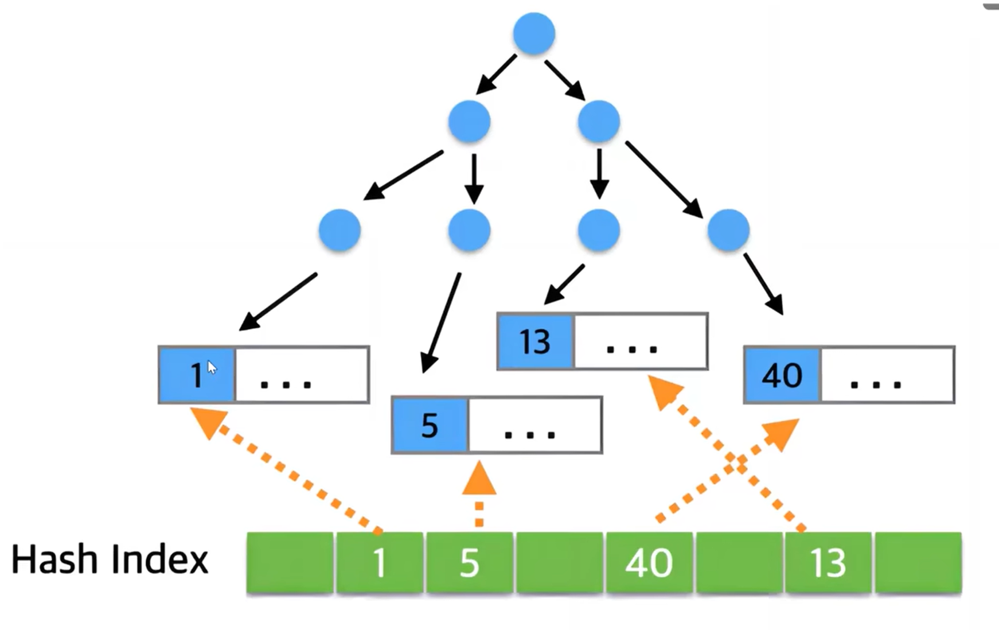
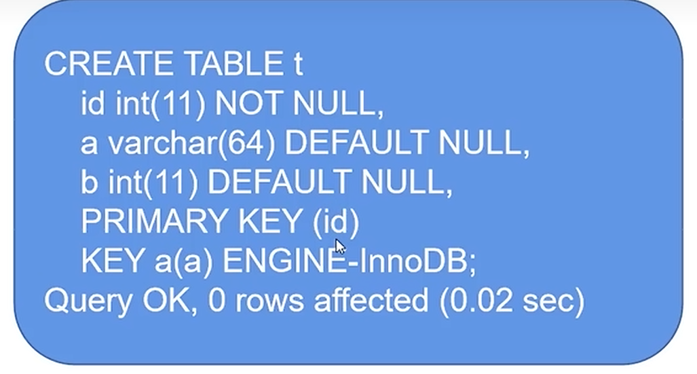

[TOC]

## 比B+树更快的索引方式：自适应hash索引

经常被访问的热点数据，一次io就会获得数据

这个hash索引默认关闭，开启之后会在buffer pool中，大小是buffer pool的1/64

## 索引选择性陷阱和如何解决

**like关键字**

- 尾匹配和任意匹配会导致全表扫描
- 头匹配会命中索引

**索引选择性太差**

比如你在数据库查询性别为男性的消防队员，因为几乎所有的队员都是男性，所以索引的选择性太差导致了全表扫描。如果换成女性就会大大提高索引效率。

你就算是给sex建立了索引也会走全表扫面，所以我们在建立索引的时候还要考虑==索引数据的分布情况==（大于20%）

**我们要如何解决？**

1. 组合索引：比如查女护士，可以增加科室等其他的条件。
2. 引入搜索引擎：如Solr（更换数据源）分片多线程检索。弊端就是：在架构中增加了复杂度，而且数据一致性同步上会有问题。
3. 强制使用索引
4. 增加缓存，提高全表扫描的速度

## 为什么用了索引还是会很慢

首先用到了索引和执行时间是没有必然的关系的。能够影响到执行时间的是==扫描行数==和==回表次数==

在sql中慢查询的阈值一般是10s（通常缩短到1s），当sql执行后大于10s就会被记录到sql的慢查询日志中去

针对回表次数，我们可以用联合索引

