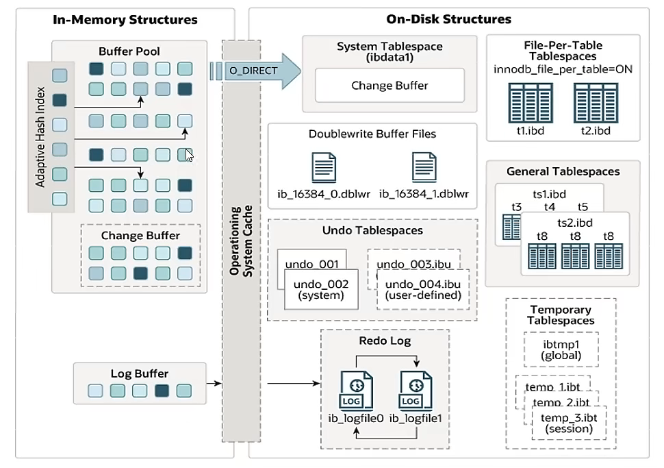

# InnoDB

从5.5默认都是使用InnoDB，事务处理，恢复崩溃的特性。

引擎架构有两部分，==内存结构==和==磁盘结构==

1. BUffer Pool：缓冲池，用来缓存表数据和索引数据，减少磁盘的io操作，提升效率
2. change buffer：在buffer pool之中，写缓冲区。针对二级索引页（辅助索引）的更新优化措施
3. Log buffer：日志缓冲区：缓存log文件（redo undo），日志文件会定期到磁盘中的log文件中：用来优化每次写入操作都要写入redolog产生的磁盘io
4. 自适应的hash索引：inoodb不支持手动创建hash索引的，但是他会自动调优，如果判断可以提升查询效率，他就会在内存中创建相关的hash索引