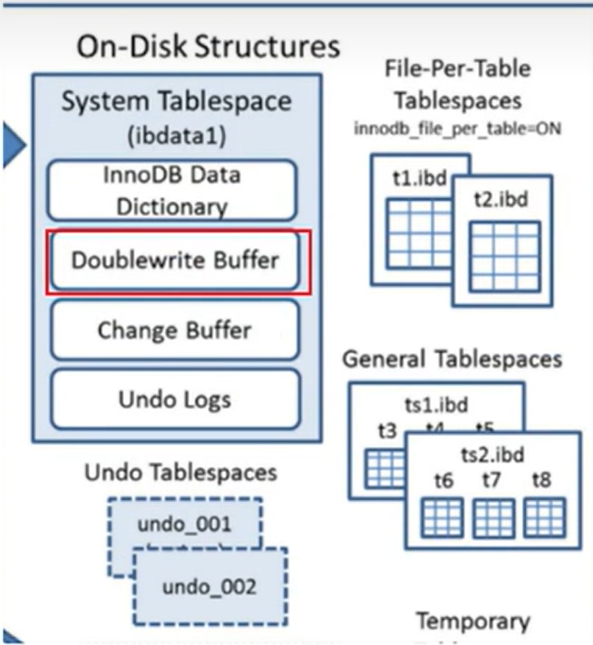
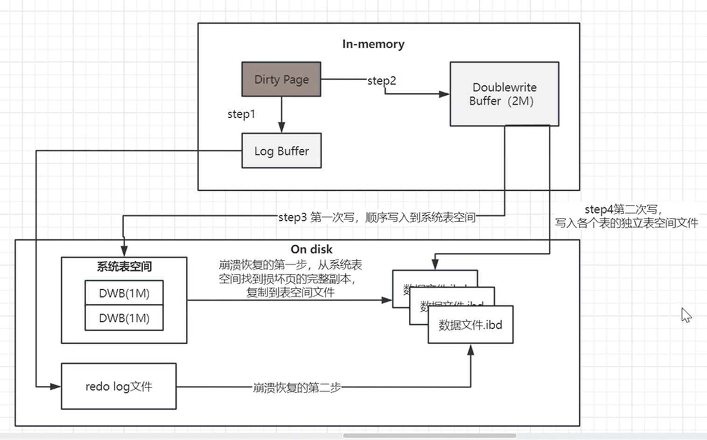

# 写失效

## 什么是写失效

linux的文件系统页默认大小是4k，mysql的默认大小是16kb。两者是不一致的，所以Innodb写入磁盘时，一个页要分为4次来写入。这就会存在一种情况，如果存储引擎正在写入页数据到磁盘时发生了宕机，所以就会导致页数据不能完整的写入。而且这种情况靠redolog是无法恢复的。

## 如何解决写失效：双写缓冲区（内存+磁盘）

1. 内存结构：

   内存由128个page页构成，2MB

2. 磁盘结构：

   在系统表空间中有128个物理页

## 数据双写流程

在刷新 数据到真正的磁盘位置之前，会将数据存储在双写缓冲区，这样在写失效的时候，在redolog之前，通过缓冲区的副本来还原物理磁盘，然后在进行日志的重做。

