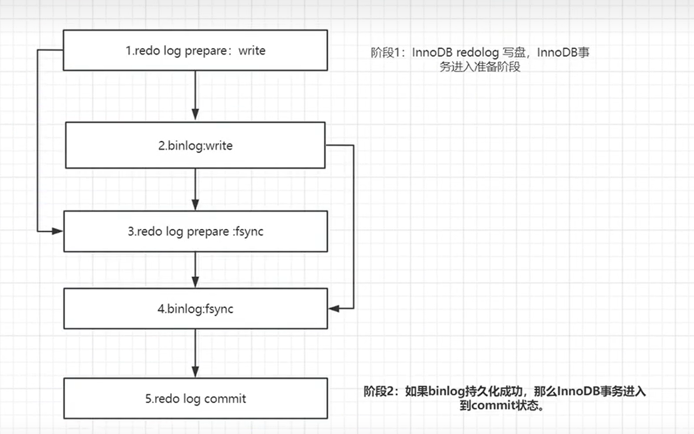

# 事务

四大特性：ACID

A:原子性

C:一致性

I：隔离性

D：持久性

能够实现的底层支持是：innodb的**redo log**和 **undo log**

1. rodo log保证了事务的持久性
2. undo log保证了事务的原子性和隔离性

## 原子性

事务作为一个整体被执行的，要么全部被执行，要么都不执行。

**undo log保证了事务的原子性和隔离性**：事务的回滚也是依赖这个：具体看帅地的

## 一致性

指的是在数据库事务执行的过程中，数据库从一个一致的状态转换到另一个一致的状态。换句话说，当数据库事务成功提交后，数据库应该保持一致性。

具体来说，数据库事务的一致性要求满足以下几个方面：

1. **数据约束的保持**：数据库中定义的各种数据约束，如唯一性约束、外键约束等，必须在事务执行的过程中得到保持。例如，如果某个数据列有唯一性约束，那么在事务执行后，该列中的值应该仍然是唯一的。
2. **业务规则的遵循**：数据库事务执行的结果必须符合业务规则和逻辑。这意味着事务中的操作应该是按照业务规则执行的，不应该违反业务规则或导致数据不一致的情况发生。
3. **数据完整性的维护**：数据库中的数据应该保持完整性，即不应该出现不一致或不合法的数据状态。在事务执行过程中，如果有任何操作导致数据完整性受到破坏，应该能够通过事务回滚或其他手段来恢复数据的完整性。
4. **数据库的状态转换**：数据库事务的执行过程中，从一个一致的状态转换到另一个一致的状态。这意味着事务执行后，数据库应该处于一个合法、一致的状态，不应该出现不合理的状态转换或不一致的数据状态。

## 隔离性

一个事务的执行不能被其他的事务干扰，一个事务使用的数据和操作对其他并发事务是隔离的

1. 脏读
2. 不可重复读
3. 幻读

## 持久性

事务一旦提交，对数据库中数据的改变是永久的。依赖redo和bin log

这里想一下redo log的两阶段提交

****

为什么要有两阶段的提交？

​	使用两阶段提交，主要是redo和bin要保持一致性。当恢复的时候，redo和bin都有一个xid，在恢复的时候会顺序扫描redolog

1. 如果redo有prepare和commit，就通过了验收，直接提交
2. 如果只有prepare，就用xid区bin找，看一下事务是否完整
3. 如果完整，补上commit
4. 不完整，回滚。