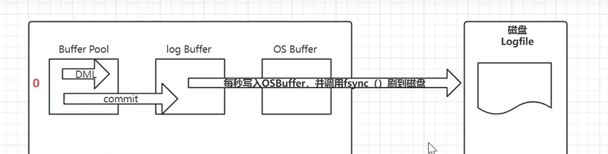
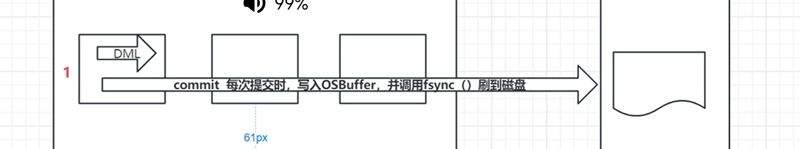
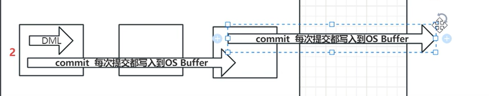

# 事务没有被提交，redo log能不能被持久化到磁盘？

## redo log的持久化

log buffer缓冲区的数据，是不能直接写入到磁盘的。还需要经过一层os buffer（系统缓冲区），再通过系统调用将其刷到磁盘。

日志数据----->log buffer（用户态） -----> os buffer（内核态）----->redo log file,真正的落盘操作需要执行fsync()完成的

## redo log持久化策略有三种

- 延时写
- 实时写，实时刷
- 实时写，延时刷

1. 延时写

   如图所示，每秒才会将缓存的数据刷新到磁盘中

2. 实时写，实时刷

   你点一下commit，就会直接刷到磁盘，刷成功了才会给你返回cmmit成功

   

3. 实时写，延时刷

   

   

### 那种选择好啊

1. 延时写：有一秒的间隔，会导致上一秒的事务数据都会丢失
2. 实时写，实时刷：最安全，所有的commit都不会丢失，但是太频繁了
3. 实时写，延时刷：只有操作系统崩溃的时候才会丢失，mysql崩溃的时候不会影响

# 总结题目

最安全的redolog模式是：写入磁盘成功才会返回commit，证明在commit之前部分数据就已经写入磁盘了，只是没有给他们在磁盘中标记commit。