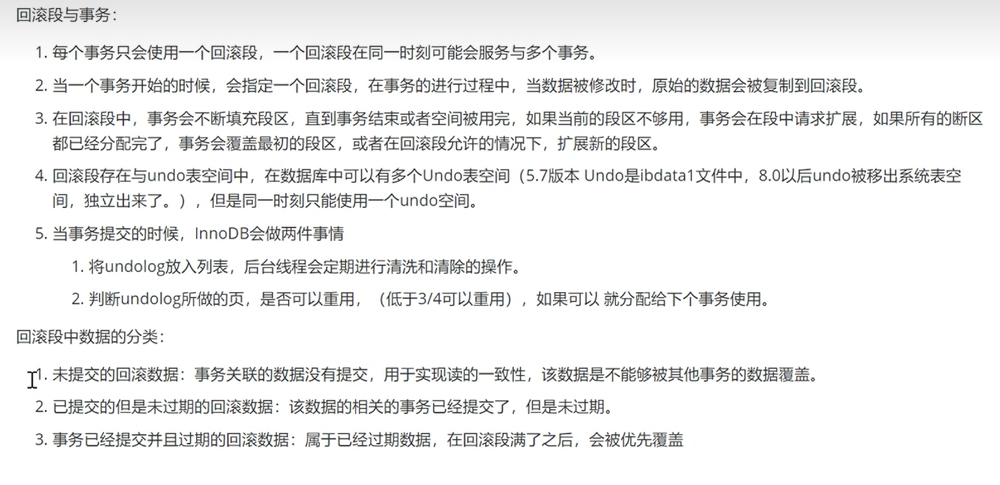

# undolog的基本概念

用于事务撤销、回退，事务隔离的日志。在数据库。当数据库回滚时候或者数据库崩溃的时候，可以来利用undolog进行回退。

# undo log作用

- 提供回滚操作（实现事务的原子性）（redo log记录的物理日志，undolog记录的是逻辑日志，理解为sql语句的样子，记录了做了什么操作）
- 协助实现多版本并发控制（mvcc）

# undolog存储机制

- 为了保证事务并发操作时，写undolog不产生冲突，innodb采用了回滚段的方式维护undolog的并发控制和持久化。

- 每隔undo表空间有128个回滚段，每隔回滚段有1024个undo段，假设每个undo段服务一个事务，所以最多支持1024*128

 

#  undo 页的运行逻辑

# undolog 存储了哪些信息

1. 数据更新前的记录

2. rowid ， 事务id， 回滚指针
   - rowid：如果一张表没有显式的定义主键，并且表中也没有指定唯一索引字段，那么innodb对添加一个row_id作为主键
   - 事务id：事务中对某条记录进行dml操作时，就会将事务的id写入到trx_id中去
   - 归滚指针：指向历史版的undolog的指针（这不就是mvcc吗）

# mvcc原理（重点：看另一个b站视频，我的收藏mvcc）

==重点是快照读，当前读==

# undo log 工作流程

