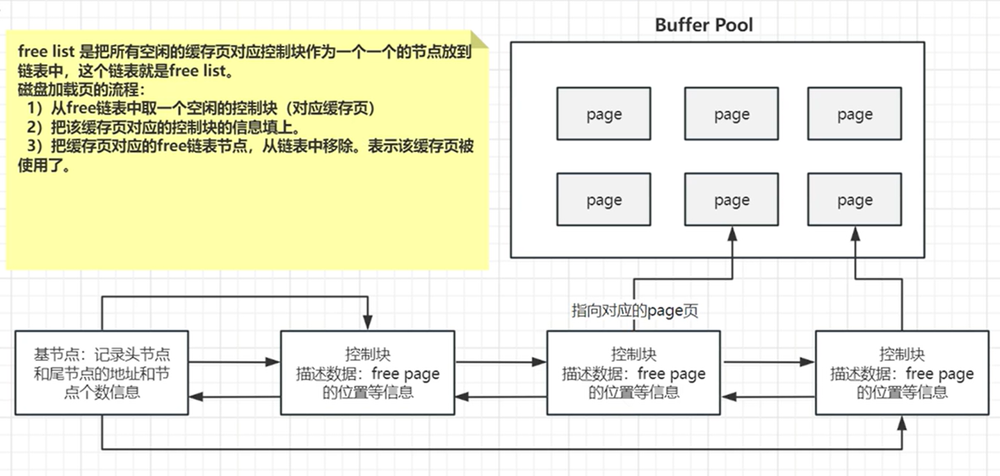
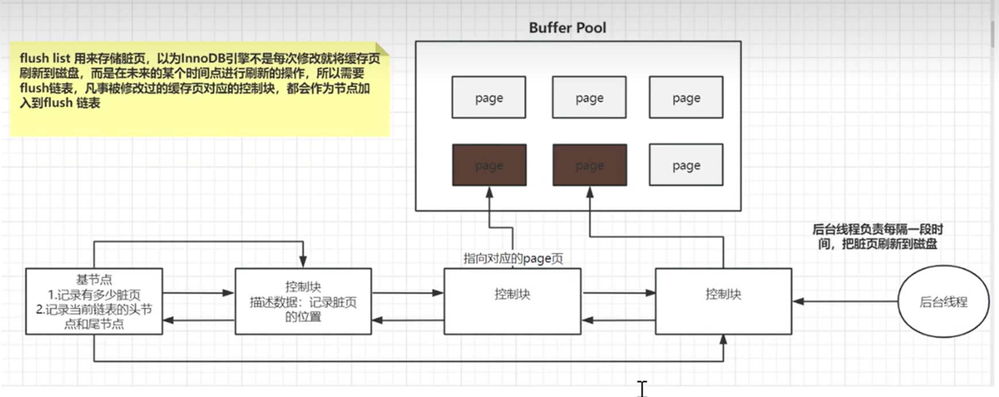

# page 页的分类

BP底层采用链表的数据结构来管理page。

Page根据状态分为3中类型：

1. free Page：未被使用的page
2. clean page：被使用了，但是数据没有被修改过
3. dirty page：脏页，被使用过的page，而且数据被修改了（==缓存数据和磁盘的数据不一致==）

上述3中数据类型，BP用3种链表结构进行管理。

首先，链表有一个==基节点==：记录头节点，尾节点的地址信息和节点的个数

1. free lists: 把所有空闲的**控制块**，当作节点放在链表当中。

   

   **磁盘加载页的流程如下：**

   1. 从free链表中取一个空闲的控制块对应的缓存页
   2. 把该缓存页对应的控制块信息填上
   3. 把缓存页从free链表中移除，表示该缓存页被使用了。
   4. 将控制块放入其他的链表中管理

2. flush list：表示需要刷新到磁盘的缓冲区，管理的就是脏页，内部的page按照**修改时间来排序**的。

   innodb不是每次修改页就将缓存页刷到磁盘的，所以需要一个缓存来存放脏页。被修改的页的控制块会作为节点加入到链表中。

   也有一个基节点。

   1. 有一个后台线程，负责每隔一段时间把脏页刷新到磁盘
   
      

3. lru list：管理正在使用的缓冲区，管理clean page和dirty page，该缓冲区以**mid point作为基点**，前面的是new 列表区，存放经藏被访问的数据页占了63%，后面的链表作为old链表区，存放的较少的数据页，占了37%。

   ==注意==，脏页在lru list和flush list都存在，但是互不影响，因为两者的作用不一样。flush list是负责落盘的，但是lru list是管理缓存空间的可用性的，释放数据页给新的页。