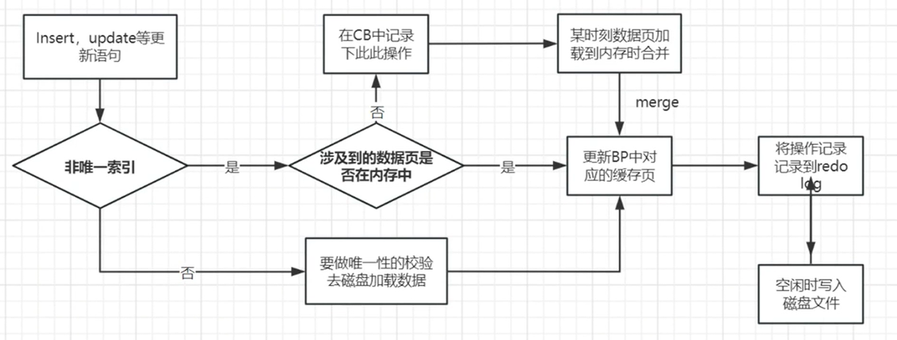

# change buffer

change buffer ：写缓冲区，针对辅助索引（二级索引，非唯一索引）的更新优化措施（DML操作insert， update语句）

## change buffer作用

1. 请求的**数据页没有在缓冲池中**的时候，并不会立刻进行io，而是在change buffer中进行修改，再合适的时候一块进行落盘。这样**解决频繁io的问题**
2. c**hange buffer在buffer pool之中占了25到50**，可以进行配置修改
3. 在**写多读少的场景中，比较试用**，原因和落盘的时机相关，因为change buffer中的页在被访问的时候会落盘，你读的太频繁会使落盘也变得频繁。加大了io操作。

## 落盘时机

1. 当change buffer中的数据页加载到缓存中后（你访问到change buffer里面存在的数据页），就会把变更merge到数据页中

2. innodb也会定期将change buufer进行落盘操作
3. 数据库正常关闭，也会进行落盘

## change buffer 一些问题

1. **为什么不适用于唯一索引**

> 唯一索引的DML操作会将数据页读入内存，来判断索引的唯一性（你要插入id = 4，我要先看看是不是已经存在了），数据页都在内存中了，就直接把数据更新在内存的数据页中了。**为什么非唯一索引就可以**

2.  **非唯一索引就可以？**

> 非唯一索引没有验证唯一性这一步，所以可以

3. **会不会产生数据的丢失？**

> 不会，因为在更细操作的同时会记录到redolog中，虽然没有落盘但是在redolog已经存在了，当异常断电，将redolog重新写入就可以了

## change buffer使用流程

