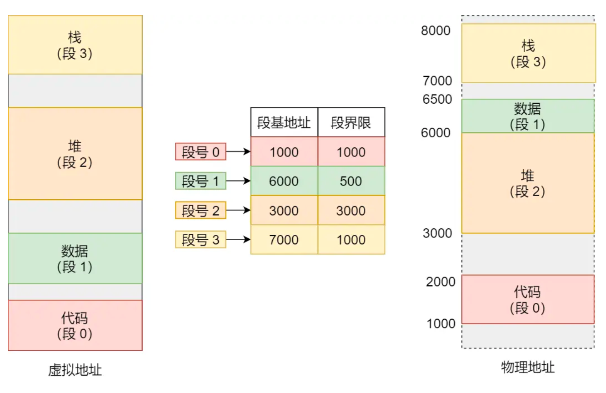
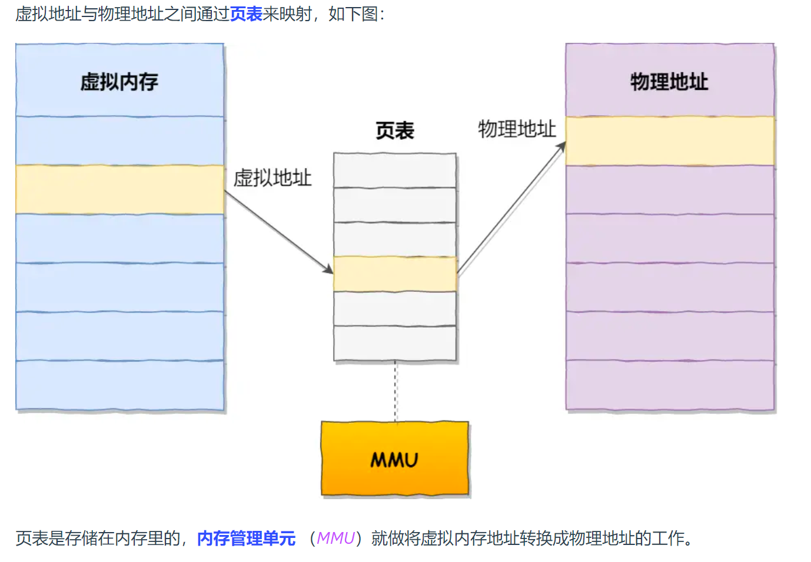
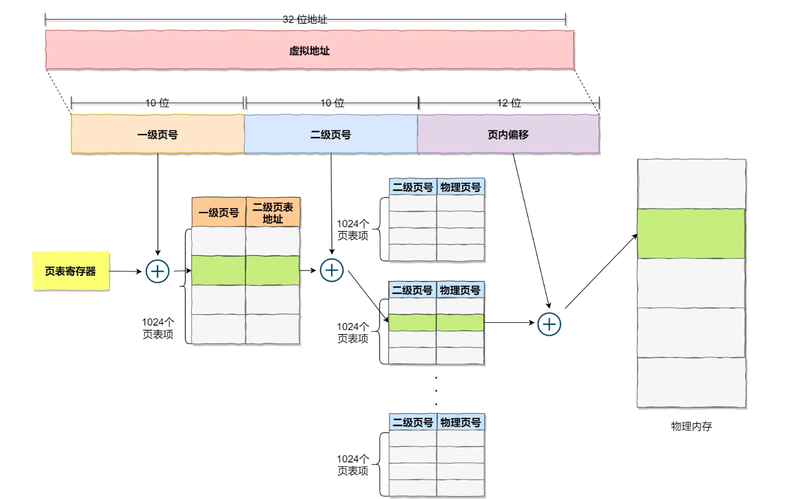
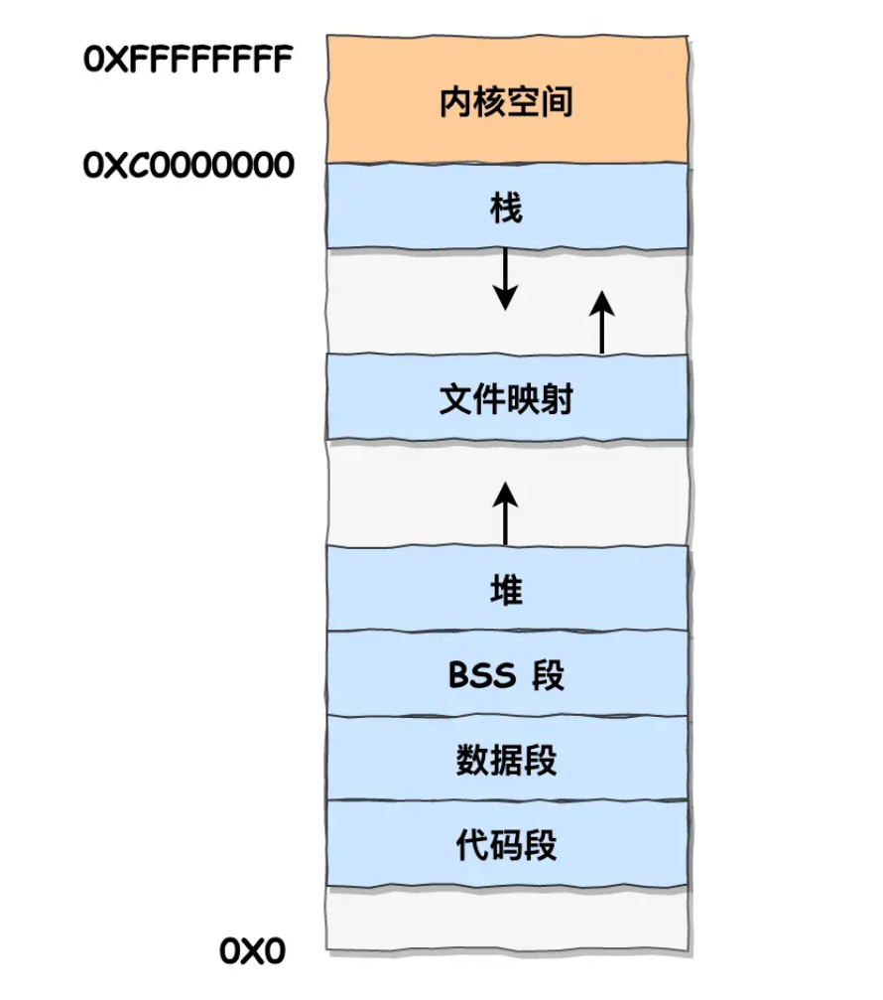

# 什么是虚拟内存？怎么管理虚拟内存

## 1. 为什么要有虚拟内存呢？

1. 如果没有虚拟内存，只有绝对的物理内存那是单片机。使用虚拟内存我们可以把进程所使用的地址「隔离」开来，即让操作系统为每个进程分配独立的一套「**虚拟地址**」，人人都有，大家自己玩自己的地址就行，互不干涉。

## 2. 如何通过虚拟内存找到物理内存呢？

主要通过两方是来实现虚拟内存和物理内存的映射

- 内存分段
- 内存分页

### 2.1 内存分段

**有什么问题呢？**

1. 第一个就是**内存碎片**的问题。

   好理解，一个段释放了，到那时很小，所以就有了段间的内存碎片的存在

2. 第二个就是**内存交换的效率低**的问题。

   这个就是为了解决第一个问题的后遗症，要移动内存来排除掉内存碎片（内存写到硬盘上，然后再从硬盘上读回来到内存里。不过再读回的时候，我们不能装载回原来的位置，而是紧紧跟着那已经被占用了的内存上）这样就会损耗时间

### 2.2 内存分页

**分页是把整个虚拟和物理内存空间切成一段段固定尺寸的大小**。这样一个连续并且尺寸固定的内存空间，我们叫**页**（*Page*）。在 Linux 下，每一页的大小为 `4KB`。==这个页大小有意思，因为这个页大小和mysql的页不一致还会有缓存双写解决写失败问题==

==如何解决掉段内存存在的两个问题呢？==

1. **解决内存碎片**

   这个很简单，没有了外部碎片，但是存在内部碎片

2. **解决内存交换**

   而当进程访问的虚拟地址在页表中查不到时，系统会产生一个**缺页异常**，进入系统内核空间分配物理内存、更新进程页表，最后再返回用户空间，恢复进程的运行。每次进行io的都是页为单位，很小所以内存交换页很块

==分页还可以怎么优化？==

1. 采用多级的页表

   

2. TLB技术（块表）

   多级页表虽然解决了空间上的问题，但是虚拟地址到物理地址的转换就多了几道转换的工序，这显然就降低了这俩地址转换的速度，也就是带来了时间上的开销。

   把最常访问的几个页表项存储到访问速度更快的硬件，于是计算机科学家们，就在 CPU 芯片中，加入了一个专门存放程序最常访问的页表项的 Cache，这个 Cache 就是 TLB（*Translation Lookaside Buffer*） ，通常称为页表缓存、转址旁路缓存、快表等。

### 2.3 段页式

- 先将程序划分为多个有逻辑意义的段，也就是前面提到的分段机制；
- 接着再把每个段划分为多个页，也就是对分段划分出来的连续空间，再划分固定大小的页；

## 3. 物理内存的布局

- 代码段，包括二进制可执行代码；
- 数据段，包括已初始化的静态常量和全局变量；
- BSS 段，包括未初始化的静态变量和全局变量；
- 堆段，包括动态分配的内存，从低地址开始向上增长；
- 文件映射段，包括动态库、共享内存等，从低地址开始向上增长（[跟硬件和内核版本有关 (opens new window)](http://lishiwen4.github.io/linux/linux-process-memory-location)）；
- 栈段，包括局部变量和函数调用的上下文等。栈的大小是固定的，一般是 `8 MB`。当然系统也提供了参数，以便我们自定义大小；

## 总结：虚拟内存有啥用啊

- 第一，虚拟内存可以使得进程对运行内存超过物理内存大小，因为程序运行符合局部性原理，CPU 访问内存会有很明显的重复访问的倾向性，对于那些没有被经常使用到的内存，我们可以把它换出到物理内存之外，比如硬盘上的 swap 区域。
- 第二，由于每个进程都有自己的页表，所以每个进程的虚拟内存空间就是相互独立的。进程也没有办法访问其他进程的页表，所以这些页表是私有的，这就解决了多进程之间地址冲突的问题。
- 第三，页表里的页表项中除了物理地址之外，还有一些标记属性的比特，比如控制一个页的读写权限，标记该页是否存在等。在内存访问方面，操作系统提供了更好的安全性。