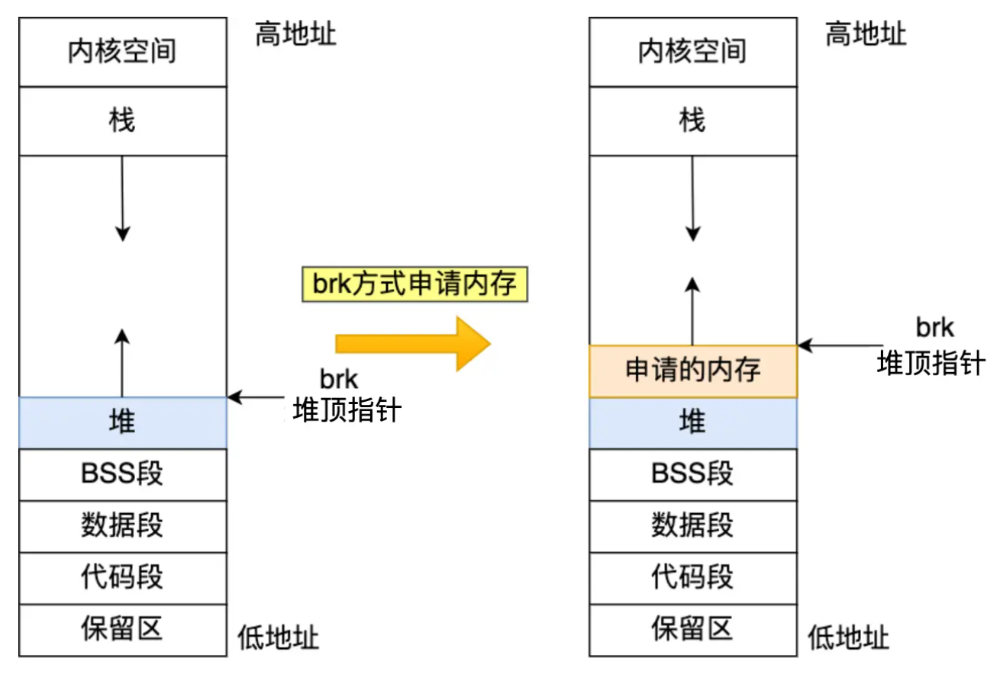
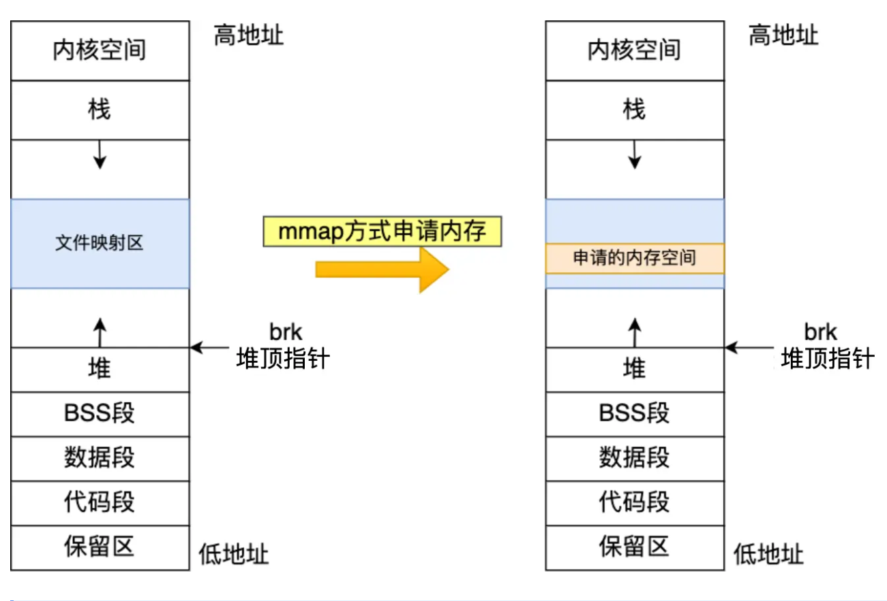

## malloc 是如何分配内存的？

malloc 申请内存的时候，会有两种方式向操作系统申请堆内存。

- 方式一：通过 **brk()** 系统调用从堆分配内存
- 方式二：通过 **mmap()** 系统调用在文件映射区域分配内存；

##  **brk()**

## mmap

## 两者什么时候用哪一个呢？

malloc() 源码里默认定义了一个阈值：

- 如果用户分配的内存小于 128 KB，则通过 brk() 申请内存；
- 如果用户分配的内存大于 128 KB，则通过 mmap() 申请内存；

**malloc() 分配的是虚拟内存**。

**如果分配后的虚拟内存没有被访问的话，虚拟内存是不会映射到物理内存的，这样就不会占用物理内存了。**只有在访问已分配的虚拟地址空间的时候，操作系统通过查找页表，发现虚拟内存对应的页没有在物理内存中，就会触发缺页中断，然后操作系统会建立虚拟内存和物理内存之间的映射关系。

## 来说一下free吧

==free后释放内存会还给操作系统吗==？

1.  malloc 通过 brk() 方式申请

   不会，先缓存着放进 malloc 的内存池里，当进程再次申请 相同字节的内存时就可以直接复用，这样速度快了很多。

2. 如果 malloc 通过 mmap 方式申请的内存

   会给操作系统

==为什么会有如此的差异呢？==

因为两个函数申请内存的位置不一样，brk是堆上的，堆只能先进先出，所以下面的free了，上面还有没有free的你就只能等着。这样会产生很多的**内存碎片**因此，随着系统频繁地 malloc 和 free ，尤其对于小块内存，堆内将产生越来越多不可用的碎片，导致“内存泄露”。而这种“泄露”现象使用 valgrind 是无法检测出来的。

**频繁通过 mmap 分配的内存话，不仅每次都会发生运行态的切换，还会发生缺页中断（在第一次访问虚拟地址后），这样会导致 CPU 消耗较大**。

==free() 函数只传入一个内存地址，为什么能知道要释放多大的内存？==

malloc 返回给用户态的内存起始地址比进程的堆空间起始地址多了 16 字节吗？

这个多出来的 16 字节就是保存了该内存块的描述信息，这样当执行 free() 函数时，free 会对传入进来的内存地址向左偏移 16 字节，然后从这个 16 字节的分析出当前的内存块的大小，自然就知道要释放多大的内存了。