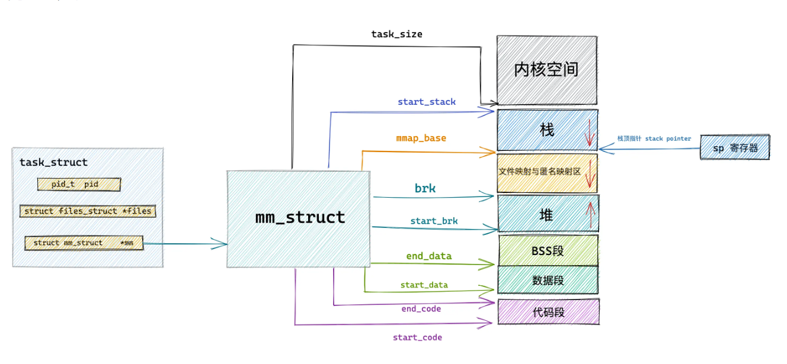

## 进程虚拟内存的空间管理

```c
struct task_struct {
        // 进程id
	    pid_t				pid;
        // 用于标识线程所属的进程 pid
	    pid_t				tgid;
        // 进程打开的文件信息
        struct files_struct		*files;
        // 内存描述符表示进程虚拟地址空间
        struct mm_struct		*mm;

        .......... 省略 .......
}
```

这就是一个进程描述符，里面的 mm_struct 结构，包含了这个进程包含的虚拟内存空间的信息。

==linux 的进程创建==（这里是拷贝，拷贝你可以读，但是你一旦要写了，就得开新的空间了）

当我们fork的时候，**子进程在新创建出来之后它的虚拟内存空间是和父进程的虚拟内存空间一模一样的，直接拷贝过来**。（所以都是一样的啊）

==linux 的线程创建==（这里直接是赋值）

而当我们通过 vfork 或者 clone 系统调用创建出的子进程，首先会设置 CLONE_VM 标识，这样来到 copy_mm 函数中就会进入 `if (clone_flags & CLONE_VM)` 条件中，==在这个分支中会将父进程的虚拟内存空间以及相关页表直接赋值给子进程。==这样一来父进程和子进程的虚拟内存空间就变成共享的了。也就是说父子进程之间使用的虚拟内存空间是一样的，并不是一份拷贝。子进程共享了父进程的虚拟内存空间，这样子进程就变成了我们熟悉的线程，**是否共享地址空间几乎是进程和线程之间的本质区别。Linux 内核并不区别对待它们，线程对于内核来说仅仅是一个共享特定资源的进程而已**。

## mm_struct

mm_struct这个结构体有一系列的指针来标注这各个虚拟空间的边界，还有访问的权限

