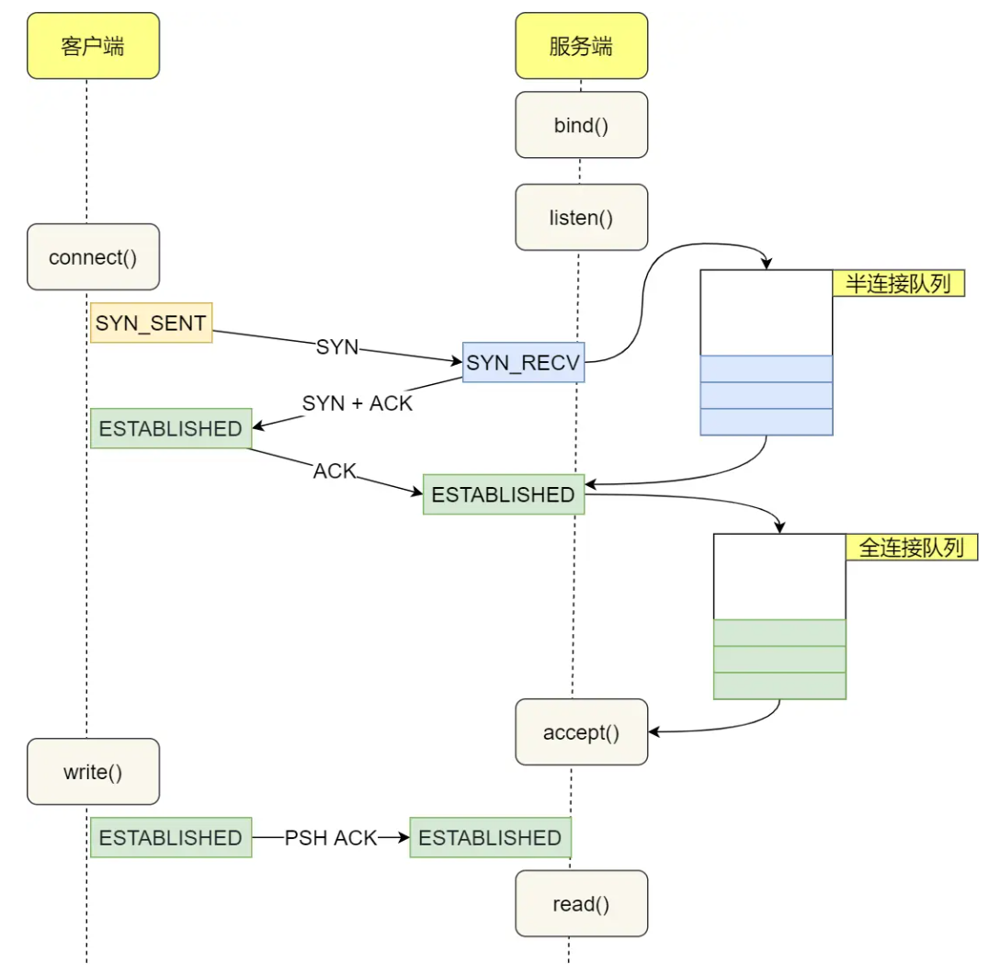
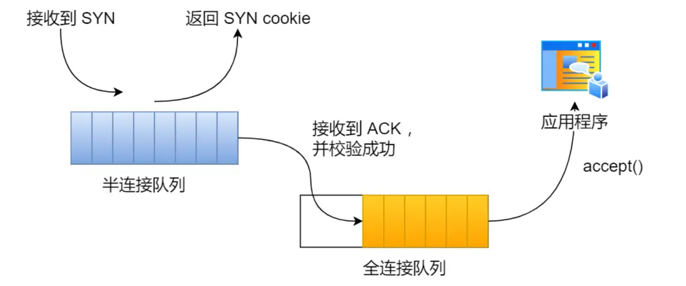

# TCP 半连接队列和全连接队列

## 什么是 TCP 半连接队列和全连接队列？

在 TCP 三次握手的时候，Linux 内核会维护两个队列，分别是：

- 半连接队列，也称 SYN 队列；
- 全连接队列，也称 accept 队列；

服务端收到客户端发起的 SYN 请求后，**内核会把该连接存储到半连接队列**，并向客户端响应 SYN+ACK，接着客户端会返回 ACK，服务端收到第三次握手的 ACK 后，**内核会把连接从半连接队列移除，然后创建新的完全的连接，并将其添加到 accept 队列，等待进程调用 accept 函数时把连接取出来。**

**不管是半连接队列还是全连接队列，都有最大长度限制，超过限制时，内核会直接丢弃，或返回 RST 包。**

## TCP 全连接队列溢出

**当服务端并发处理大量请求时，如果 TCP 全连接队列过小，就容易溢出。发生 TCP 全连接队溢出的时候，后续的请求就会被丢弃，这样就会出现服务端请求数量上不去的现象。**

实际上，丢弃连接只是 Linux 的默认行为，我们还可以选择向客户端发送 RST 复位报文，告诉客户端连接已经建立失败。

tcp_abort_on_overflow 共有两个值分别是 0 和 1，其分别表示：

- 0 ：如果全连接队列满了，那么 server 扔掉 client 发过来的 ack ；
- 1 ：如果全连接队列满了，server 发送一个 `reset` 包给 client，表示废掉这个握手过程和这个连接；

通常情况下，应当把 tcp_abort_on_overflow 设置为 0，因为这样更有利于应对突发流量。因为你重连的时候可能就有位置了，你就能进去了。

## TCP 半连接队列溢出

1. 如果半连接队列满了，并且没有开启 tcp_syncookies，则会丢弃；

# syncookies 

Syncookies的主要功能是在面对大量的SYN请求时，不需要分配资源来维护半开放连接（即SYN-RECEIVED状态的连接），从而减轻服务器的负担，防止资源耗尽。

**开启 syncookies 功能就可以在不使用 SYN 半连接队列的情况下成功建立连接**，在前面我们源码分析也可以看到这点，当开启了 syncookies 功能就不会丢弃连接。

syncookies 是这么做的：服务器根据当前状态计算出一个值，放在己方发出的 SYN+ACK 报文中发出，当客户端返回 ACK 报文时，取出该值验证，如果合法，就认为连接建立成功，如下图所示。

1. **接收到SYN请求**： 当服务器接收到一个SYN请求时，如果当前的SYN队列已满或超过了预设的阈值，服务器将进入syncookies模式。

2. **生成SYN-ACK响应**： 在正常情况下，服务器在接收到SYN请求后会为该请求分配一个半开放连接，并发送一个SYN-ACK响应。然而，在syncookies模式下，服务器不会分配任何资源，而是生成一个特殊的SYN-ACK响应，其中包含一个经过加密计算的序列号。这个序列号是根据客户端的IP地址、端口号、服务器的秘密密钥和时间戳计算出来的。

   序列号生成公式类似如下：

   sequence_number=hash(client_IP,client_port,server_secret,timestamp)sequence_number=hash(client_IP,client_port,server_secret,timestamp)

3. **发送SYN-ACK响应**： 服务器将这个包含特殊序列号的SYN-ACK响应发送给客户端。

4. **接收到ACK响应**： 客户端收到SYN-ACK后，会回复一个ACK响应，表示完成三次握手。如果服务器在接收到这个ACK时，发现当前连接队列还有空间，且ACK的序列号能够正确解码验证，那么服务器将根据这个ACK请求重新分配一个连接，恢复正常的连接处理流程。

   验证ACK序列号的过程包括：

   - 从ACK中提取时间戳信息，检查其是否在合理的时间范围内。
   - 使用相同的公式和服务器秘密密钥重新计算序列号，并与ACK中的序列号进行比较。
   - 如果匹配，说明这是一个有效的ACK，服务器为该连接分配资源，进入ESTABLISHED状态。

这里给出几种防御 SYN 攻击的方法：

- 增大半连接队列；
- 开启 tcp_syncookies 功能
- 减少 SYN+ACK 重传次数