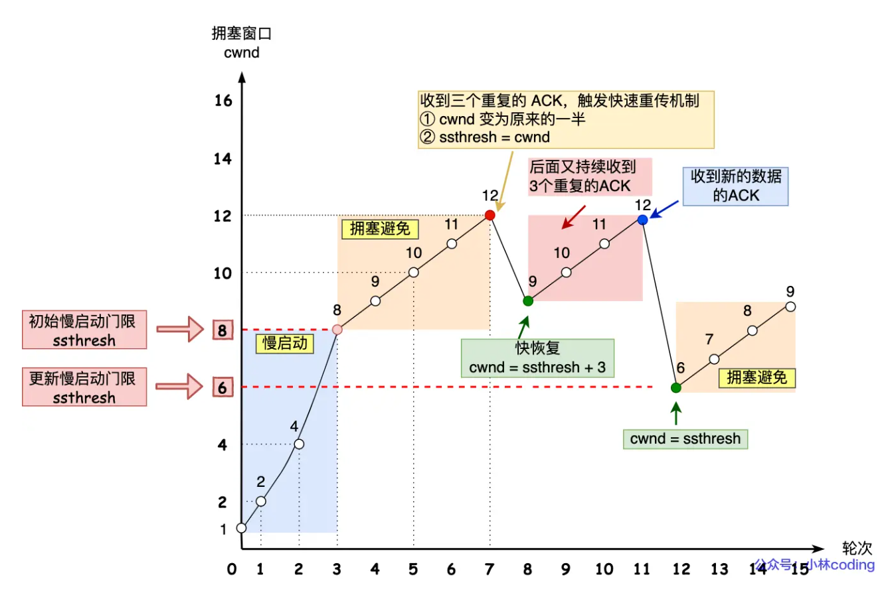

# 重传机制

接下来说说常见的重传机制：

- 超时重传
- 快速重传
- SACK
- D-SACK

## 超时重传

重传机制的其中一个方式，就是在发送数据时，设定一个定时器，当超过指定的时间后，没有收到对方的 `ACK` 确认应答报文，就会重发该数据，也就是我们常说的**超时重传**。

TCP 会在以下两种情况发生超时重传：

- 数据包丢失：没收到ack，重传
- 确认应答丢失：没收到ack，重传

## 快速重传

TCP 还有另外一种**快速重传（Fast Retransmit）机制**，它**不以时间为驱动，而是以数据驱动重传**。

收到三次重复的ack，直接重传。

# 滑动窗口

TCP 头里有一个字段叫 `Window`，也就是窗口大小。

**这个字段是接收端告诉发送端自己还有多少缓冲区可以接收数据。于是发送端就可以根据这个接收端的处理能力来发送数据，而不会导致接收端处理不过来。**

所以，通常窗口的大小是由接收方的窗口大小来决定的。

1. **窗口大小（Window Size）**： 窗口大小表示发送方可以发送但尚未收到确认的数据的最大字节数。窗口大小由接收方指定，并在TCP报文的头部中包含的窗口字段进行通告。
2. **窗口移动**： 当发送方发送数据并收到接收方的确认（ACK）时，窗口向前滑动，从而允许发送更多的数据。例如，如果窗口大小为500字节，当发送方收到100字节的确认时，窗口将向前滑动100字节。
3. **窗口调整**： 接收方根据其当前的缓冲区状态可以动态调整窗口大小。如果接收方的缓冲区快满了，它可以减小窗口大小，反之亦然。

# 流量控制

流量控制的主要目的是防止发送方发送数据过快，以至于接收方来不及处理，导致缓冲区溢出。TCP通过滑动窗口实现流量控制，具体机制如下：

1. **接收窗口（Receiver Window）**： 接收窗口是接收方通告给发送方的窗口大小，表示接收方当前可以接收的最大数据量。发送方会根据这个窗口大小调整其发送速率。
2. **窗口通告（Window Advertisement）**： 接收方在每个ACK报文中都会通告当前的接收窗口大小。发送方根据最新的窗口大小决定可以发送的未确认数据量。
3. **零窗口（Zero Window）**： 当接收方的缓冲区满时，它会通告一个窗口大小为零的窗口，告诉发送方停止发送数据。发送方在接收到零窗口通知后，会停止发送数据，并周期性地发送窗口探测（Window Probe）报文，询问接收方是否有新的缓冲区可用。一旦接收方有空间可用，它会通告一个非零的窗口，发送方就可以继续发送数据。

# 拥塞控制

CP的拥塞控制机制旨在防止网络拥塞，从而确保高效和公平的数据传输。拥塞控制主要包括以下四个核心算法：慢启动（Slow Start）、拥塞避免（Congestion Avoidance）、快重传（Fast Retransmit）和快恢复（Fast Recovery）。下面是对这些算法的详细介绍：

### 1. 慢启动（Slow Start）

慢启动是TCP在新连接建立或重传超时后启动的机制，其目的是逐步增加发送数据量，以避免立即使网络拥塞。

- **初始状态**：拥塞窗口（cwnd）通常初始化为一个较小的值，如1或10个MSS（最大报文段大小）。
- **指数增长**：每次收到一个ACK，cwnd增加一个MSS。这意味着每经过一个往返时间（RTT），cwnd值将翻倍。
- **阈值（ssthresh）**：当cwnd达到阈值（ssthresh）时，慢启动结束，进入拥塞避免阶段。

### 2. 拥塞避免（Congestion Avoidance）

在拥塞避免阶段，cwnd的增长速度放缓，以避免引发拥塞。

- **线性增长**：每个RTT内，cwnd仅增加一个MSS，而不是指数增长。
- **增长公式**：每次收到一个ACK，cwnd增加𝑀𝑆𝑆𝑐𝑤𝑛𝑑*c**w**n**d**MSS*个MSS。

### 3. 快重传（Fast Retransmit）

快重传用于在检测到数据包丢失时，迅速重传丢失的数据包，而不需要等待重传超时。

- **重复ACK**：如果发送方连续收到三个重复的ACK（即对同一个数据包的确认），发送方立即重传被认为丢失的数据包。这通常表示网络出现了丢包现象。

### 4. 快恢复（Fast Recovery）

快恢复在快重传之后，用于避免在丢包后将cwnd减少到最小值。

- **调整cwnd**：当检测到丢包并执行快重传时，ssthresh设置为当前cwnd的一半，然后cwnd设置为ssthresh值加上3个MSS（代表三个重复ACK）。
- **重传后恢复**：在丢包恢复期间，每次收到一个新的ACK，cwnd增加一个MSS。当新数据包的ACK被收到时，恢复到拥塞避免阶段。