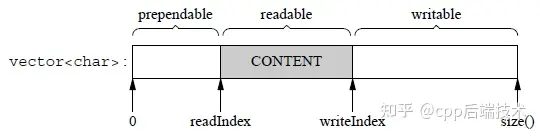

## 公共技能部分

### 1. 说一下c11和c14你经常用的新特性

我经常用的封装类是thread类还有atomic类。

- atomic：

  用了CAS，原子指令，实现了无锁的操作

  是一种多线程编程中常用的同步机制，整型、指针、布尔值等，只需要通过std::atomic<T>定义一个原子变量即可。

  ```c++
  std::atomic<T>::store()是一个成员函数，用于将给定的值存储到原子对象中。
      
  void store(T desired, std::memory_order order = std::memory_order_seq_cst) volatile noexcept;
  void store(T desired, std::memory_order order = std::memory_order_seq_cst) noexcept;
  desired：要存储的值。
  order：存储操作的内存顺序。默认是std::memory_order_seq_cst（顺序一致性）。
  
  ```

  ```cpp
  template< class T >
  T exchange( volatile std::atomic<T>* obj, T desired );
  其中，obj参数指向需要替换值的atomic对象，desired参数为期望替换成的值。如果替换成功，则返回原来的值。
  
  整个操作是原子的（原子读-修改-写操作）：从读取（要返回）值的那一刻到此函数修改值的那一刻，该值不受其他线程的影响。
  ```

  ```cpp
  load函数用于获取原子变量的当前值。它有以下两种形式：
  T load(memory_order order = memory_order_seq_cst) const noexcept;
  operator T() const noexcept;
  ```

- thread类

- auto关键字，范围for循环，std::move右值引用 ，

- shared_ptr：

  1. **RAII** 的做法是使用一个对象，在其构造时获取资源，在对象生命期控制对资源的访问使之始终保持有效，最后在对象析构的时候释放资源
  2. **引用计数**，允许多个 share_ptr 指向同一资源，每多一个 share_ptr 指向该资源，share_ptr 的引用计数就 +1 ，减为0时表示没有 share_ptr 对该资源进行引用了，就会释放所指向的资源。

### 2. 介绍一下stl 容器的内存分布和存取特点

- vector：std::vector 

  - 是基于动态数组实现的。它通过动态分配内存和扩展机制来管理内存，存储元素在连续的内存块中。vector 提供高效的随机访问性能，插入和删除操作在末尾最为高效，但在中间进行插入删除操作的效率相对较低。

  - std::vector 的扩容机制是在容量不足时，通常以1.5倍或2倍的增长率扩展容量。扩容时会分配新内存，复制旧数据到新内存，释放旧内存。

  - 删除元素后，内存不会自动释放，需要手动调用 Shrink_to_fit

- list

  - 分散的内存块
  - 随机访问低效，需遍历
  - 中间高效，末尾和开头较高效

- deque

  - 分块存储，每个定长数据块内部是顺序存储方式，同时数据块之间采用双线链接的形式组织在一起，形成逻辑上的连续。
  - 支持随机访问。支持在两端进行高效的插入和删除操作（时间复杂度为O(1)。也支持在序列中间进行插入和删除操作，但是时间复杂度为O(n)，如非必要最好不要这样使用deque，可以采用其他更符合需求的容器。

- stack

  - 根据适配的容器决定内存分布，逻辑上就是一个栈

- queue

  - 根据适配的容器决定内存分布，逻辑上就是一个队列

- map,unorder_map,multimap,unorder_multimap

  - 红黑树/hash

- set,unorder_set,multiset,unorder_multiset

  - 红黑树/hash

### 3. 介绍一下select

这个函数是跨平台的，Linux、Mac、Windows都是支持的。可以监听的文件描述符的状态：

- 读缓冲区：检测里边有没有数据，如果有数据该缓冲区对应的文件描述符就绪
- 缓冲区：检测写缓冲区是否可以写(有没有容量)，如果有容量可以写，缓冲区对应的文件描述符就绪
- 读写异常：检测读写缓冲区是否有异常，如果有该缓冲区对应的文件描述符就绪

```c++
#include <sys/select.h>
struct timeval {
    time_t      tv_sec;         /* seconds */
    suseconds_t tv_usec;        /* microseconds */
};

int select(int nfds, fd_set *readfds, fd_set *writefds,
           fd_set *exceptfds, struct timeval * timeout);
将你想要监听的文件描述符分别放到指定的参数位置就可以监听你放入的文件描述符
 在select()函数中第2、3、4个参数都是fd_set类型，它表示一个文件描述符的集合，类似于信号集 sigset_t，这个类型的数据有128个字节，也就是1024个标志位，和内核中文件描述符表中的文件描述符个数是一样的。==这也是这个select的弊病，最多监听1024个文件描述符==


```

- 函数参数：
  - nfds：委托内核检测的这三个集合中最大的文件描述符 + 1，内核需要线性遍历这些集合中的文件描述符，这个值是循环结束的条件在Window中这个参数是无效的，指定为-1即可
  - readfds：文件描述符的集合, 内核只检测这个集合中文件描述符对应的读缓冲区
    传入传出参数，读集合一般情况下都是需要检测的，这样才知道通过哪个文件描述符接收数据
  - writefds：文件描述符的集合, 内核只检测这个集合中文件描述符对应的写缓冲区
    传入传出参数，如果不需要使用这个参数可以指定为NULL
  - exceptfds：文件描述符的集合, 内核检测集合中文件描述符是否有异常状态
    传入传出参数，如果不需要使用这个参数可以指定为NULL
  - timeout：超时时长，用来强制解除select()函数的阻塞的
    NULL：函数检测不到就绪的文件描述符会一直阻塞。
    等待固定时长（秒）：函数检测不到就绪的文件描述符，在指定时长之后强制解除阻塞，函数返回0
    不等待：函数不会阻塞，直接将该参数对应的结构体初始化为0即可。
  - 函数返回值：
    大于0：成功，返回集合中已就绪的文件描述符的总个数
    等于-1：函数调用失败
    等于0：超时，没有检测到就绪的文件描述符

另外初始化fd_set类型的参数还需要使用相关的一些列操作函数，具体如下：

```c++
// 将文件描述符fd从set集合中删除 == 将fd对应的标志位设置为0        
void FD_CLR(int fd, fd_set *set);
// 判断文件描述符fd是否在set集合中 == 读一下fd对应的标志位到底是0还是1
int  FD_ISSET(int fd, fd_set *set);
// 将文件描述符fd添加到set集合中 == 将fd对应的标志位设置为1
void FD_SET(int fd, fd_set *set);
// 将set集合中, 所有文件文件描述符对应的标志位设置为0, 集合中没有添加任何文件描述符
void FD_ZERO(fd_set *set);

```

当你将readfset传入内核的时候，如果对应的readfet是1，内核会轮询检测时候有缓存，有的话不改变readfset，没有会变成0，轮询检测，传给用户层，用户层自己在检测一下。需要我们循环调用select进行检测，select返回后。我们看下是不是连接来了，是的话先接受链接，然后遍历所有的数组看一下是不是又数据来了，是的话接收数据。


### 4. 介绍一下epoll

epoll是基于红黑树来管理待检测集合的，所以效率是更高的。使用epoll没有最大文件描述符的限制，仅受系统中进程能打开的最大文件数目限制

在epoll中一共提供是三个API函数，分别处理不同的操作，函数原型如下：

```c++
#include <sys/epoll.h>

// 联合体, 多个变量共用同一块内存        
typedef union epoll_data {
 	void        *ptr;
	int          fd;	// 通常情况下使用这个成员, 和epoll_ctl的第三个参数相同即可
	uint32_t     u32;
	uint64_t     u64;
} epoll_data_t;

struct epoll_event {
	uint32_t     events;      /* Epoll events */
	epoll_data_t data;        /* User data variable */
};

// 创建epoll实例，通过一棵红黑树管理待检测集合
int epoll_create(int size);
// 管理红黑树上的文件描述符(添加、修改、删除)
int epoll_ctl(int epfd, int op, int fd, struct epoll_event *event);
// 检测epoll树中是否有就绪的文件描述符
int epoll_wait(int epfd, struct epoll_event * events, int maxevents, int timeout);
```

- 水平模式的特点： 

  - 读事件：

    如果文件描述符对应的读缓冲区还有数据，读事件就会被触发，epoll_wait()解除阻塞
    当读事件被触发，epoll_wait()解除阻塞，之后就可以接收数据了如果接收数据的buf很小，不能全部将缓冲区数据读出，那么读事件会继续被触发，直到数据被全部读出，如果接收数据的内存相对较大，读数据的效率也会相对较高（减少了读数据的次数）因为读数据是被动的，必须要通过读事件才能知道有数据到达了，因此对于读事件的检测是必须的

  - 写事件：如果文件描述符对应的写缓冲区可写，写事件就会被触发，epoll_wait()解除阻塞
    当写事件被触发，epoll_wait()解除阻塞，之后就可以将数据写入到写缓冲区了
    写事件的触发发生在写数据之前而不是之后，被写入到写缓冲区中的数据是由内核自动发送出去的
    如果写缓冲区没有被写满，写事件会一直被触发因为写数据是主动的，并且写缓冲区一般情况下都是可写的（缓冲区不满），因此对于写事件的检测不是必须的

- 边沿触发的特点：
  - 读事件：当读缓冲区有新的数据进入，读事件被触发一次，没有新数据不会触发该事件
    - 如果有新数据进入到读缓冲区，读事件被触发，epoll_wait()解除阻塞
    - 读事件被触发，可以通过调用read()/recv()函数将缓冲区数据读出
      如果数据没有被全部读走，并且没有新数据进入，读事件不会再次触发，只通知一次
      如果数据被全部读走或者只读走一部分，此时有新数据进入，读事件被触发，并且只通知一次
  - 写事件：当写缓冲区状态可写，写事件只会触发一次
    - 如果写缓冲区被检测到可写，写事件被触发，epoll_wait()解除阻塞
    - 写事件被触发，就可以通过调用write()/send()函数，将数据写入到写缓冲区中
      写缓冲区从不满到被写满，期间写事件只会被触发一次
      写缓冲区从满到不满，状态变为可写，写事件只会被触发一次

边沿触发模式必须使用非阻塞的read

### 5. 比较一下epoll和select的不同点

区别:

1. i/o模型不同，select采用轮询模型，每次都要遍历所有的文件描述符集合，epoll是基于时间驱动的模型，通过回调函数处理活跃的文件描述符，效率更高。
2. 文件描述符数量限制不同，select限制在1024左右，epoll限制数万个文件描述符，适用于高并发场景
3. 事件触发方式不同，epoll支持两种触发模式et（边缘触发），lt（水平触发）；select只支持lt；ET模式是指描述符由不可读或者不可写变为可读或者可写时，epoll才通知有事件发生，LT模式则是描述符  只要可读或者可写，epoll就通知有事件发生。
4. 内核实现机制不同:select是系统调用，每次调用都要把全部的描述符集合从用户态传输到内核态并且需要判断每个描述符是否就绪；epoll是内核空间和用户空间共享一块内存，只需要在内核空间注册一个时间表，然后等待通知，不需要对已注册的文件描述符进行遍历

### 6. 介绍一下mvc 模式

**‌[MVC设计模式](https://www.baidu.com/s?rsv_idx=1&wd=MVC设计模式&fenlei=256&usm=1&ie=utf-8&rsv_pq=f32b91ca0064e44f&oq=什么是mvc设计模式&rsv_t=ce299M4E3fe5eir1gQrozJ4u4IvT0qGZAl6s82cOj1th3Gycd6QdvzhPLh4&sa=re_dqa_zy)是一种软件架构模式，它将应用程序分为三个主要部分：模型（Model）、视图（View）和控制器（Controller）。**

- **模型（Model）**：负责处理应用程序的核心数据和业务逻辑。它通常与数据库进行交互，执行数据的增删改查操作。模型层包含了应用程序中与数据相关的所有操作和逻辑。

- **视图（View）**：负责显示数据给用户，通常是用户界面。视图层不负责处理数据或业务逻辑，它只是简单地展示模型层提供的数据。在Web应用中，视图可以是HTML页面；在桌面应用中，视图可以是窗口或对话框。

- **控制器（Controller）**：接收用户的输入，并根据输入调用模型或视图来更新应用程序的状态。控制器是模型和视图之间的协调者，它接收用户的请求，决定调用哪个模型来处理请求，并选择适当的视图来显示结果。

  

### 7. 输入url点击回车

浏览器做的第⼀步⼯作是解析 URL-- ⽣产 HTTP 请求信息【接下来就是传输这个信息我要做什么准备】

--真实目标地址查询DNS--通过 DNS 获取到 IP 后，应用程序【浏览器】就可以把 HTTP 的传输⼯作交给操作系统中的协议栈，通过调⽤ Socket 库，来委托协议栈⼯作。

【协议栈的上半部分有两块，分别是负责收发 数据的 TCP 和 UDP 协议，这两个传输协议会接受应⽤层的委托执⾏收发数据的操作。

 协议栈的下⾯⼀半是⽤ IP 协议控制⽹络包收发操作，在互联⽹上传数据时，数据会被切分成⼀块块的⽹络 包，⽽将⽹络包发送给对⽅的操作就是由 IP 负责的】

--委托 IP 模块将数据封装成⽹络包发送给通信对 象----当存在多个⽹卡时，在填写源地址 IP 时，就需要判断到底应该填写哪个地址。这个判断相当于在多块⽹卡 中判断应该使⽤哪个⼀块⽹卡来发送包。 这个时候就需要根据路由表规则，来判断哪⼀个⽹卡作为源地址 IP，然后去生成IP头部

 --- ⽣成了 IP 头部之后，接下来⽹络包还需要在 IP 头部的前⾯加上 MAC 头部【就需要 ARP 协议帮我们找到路由器的 MAC 地址】

---- ⽹络包只是存放在内存中的⼀串⼆进制数字信息，没有办法直接发送给对⽅。因此，我们需要将数字信息 转换为电信号，才能在⽹线上传输，也就是说，这才是真正的数据发送过程--负责执⾏这⼀操作的是⽹卡，要控制⽹卡还需要靠⽹卡驱动程序，⽹卡会将包转为电信号，通过⽹线发送出去。

--发送到服务器端后，电信号到达⽹线接⼝，交换机⾥的模块进⾏接收，接下来交换机⾥的模块将电信号转换为数字信号，交换机根据MAC地址就可以判断要把数据发送给那个网卡

--现在到达了路由器，并在此被转发到下⼀个路由器或⽬标设备。 这⼀步转发的⼯作原理和交换机类似，也是通过查表判断包转发的⽬标

### 8. 介绍一下iocp

iocp有两个重要的函数

```c++
CreateIoCompletionPort : 创建完成端口，绑定完成端口
GetQueuedCompletionStatus ：从完成端口取得消息
```

- iocp是如何工作的
- 

当使用IOCP时，你必须处理三件事情：

a) 将一个Socket关联到完成端口;

b) 创建一个异步I/O调用; 

c) 与线程进行同步。为了获得异步IO调用的结果，比如哪个客户端执行了调用，你必须传入两个参数：pCompletionKey参数和OVERLAPPED结构。

### 9. 十大排序算法

### 10. 详细介绍一下cpp的三大特性

1. 封装

   封装是C++面向对象三大特性之一。封装性的存在主要有两大意义：①将属性和行为作为一个整体，表现生活中的事物；②将属性和行为加以权限控制。

   - 事务的特点：将数据和操作数据的方法封装成一个类，符合对象的使用逻辑
   - 权限管理：通过三种权限的控制来控制封装对象的可见范围
   - 友元：全局函数，类，成员函数

2. 继承性

   继承方式一共有三种，分别是公共继承、保护继承、私有继承。其实就是限定了最高开放程度。

   - 同名属性：同名属性子类会被优先采用，但是用指定类名的方式也可以访问到父类的属性名

3. 多态性

   1. 虚函数

      1. 每一个具有虚函数（使用virtual关键字定义的函数）的类的**具体实现**，都有一个指向虚函数的指针表。

      2. 指向虚函数表的**指针**是**作为数据成员存在于所有对象中**。当调用虚函数时，查找对象的虚函数表指向正确的派生类函数。 **虚函数表是由虚函数指针组成的数组**。

      3. 对于类的普通成员函数使用的是静态绑定，发生在**编译期**。

         对于类的虚函数发生在运行期是动态绑定，发生在**运行期**。

         虽然虚函数的调用是在运行期才确定，但是**虚函数表的创建是在编译阶段就完成构建**。

      4. 单继承的虚函数

         1. 虚函数表派生类覆盖的虚函数的地址被放在了基类虚函数表对应的函数原来的位置。（覆盖）
         2. 派生类没有覆盖的虚函数就延用基类的。同时，虚函数按照其声明顺序放于表中，**父类的虚函数在子类的虚函数前面**。

      5. 多继承的虚函数

         1. 每个基类都有自己的虚函数表
         2. 派生类的虚函数地址存依照声明顺序**放在第一个基类的虚表最后**.

      6. 菱形继承

         虚拟继承 可以解决菱形继承的 二义性 和 数据冗余 的问题。虚拟继承的原理是通过 在派生类对象中只保留一份共享基类子对象 的方式来**消除二义性和数据冗余**。**当多个类从同一个虚基类派生时，它们共享同一个虚基类子对象。这个虚基类子对象只被构造一次，而不是被每个派生类分别构造**，因此可以消除数据冗余和二义性。

   

   

## 异常操作汇聚系统

### 1. 你说借鉴了muduo库的设计，那你介绍一下muduo库吧

Muduo库有三个核心组件支撑一个reactor实现 [持续] 的 [监听] 一组fd，并根据每个fd上发生的事件 [调用] 相应的处理函数。这三个组件分别是Channel类、Poller/EpollPoller类以及EventLoop类。

1. **Channel类**

Channel类则封装了一个 [fd] 和这个 [fd感兴趣事件] 以及事件监听器监听到 [该fd实际发生的事件]，以及发生的个时间我要怎么处理这个数据的[Function]同时Channel类还提供了设置该fd的感兴趣事件，以及将该fd及其感兴趣事件注册到事件监听器或从事件监听器上移除，以及保存了该fd的每种事件对应的处理函数。

下面是他的成员变量：

- fd_这个Channel对象照看的文件描述符 

- int events_代表fd感兴趣的事件类型集合 int

- revents_代表事件监听器实际监听到该fd发生的事件类型集合，当事件监听器监听到一个fd发生了什么事件。

- EventLoop* loop：这个fd属于哪个EventLoop对象，这个暂时不解释。

- read_callback_、write_callback_、close_callback_、error_callback_：这些是std::function类型，代表着这个Channel为这个文件描述符保存的各事件类型发生时的处理函数。

2. **Poller类**

负责监听文件描述符事件是否触发以及返回发生事件的文件描述符以及具体事件的模块就是Poller。所以一个Poller对象对应一个事件监听器（这里我不确定要不要把Poller就当作事件监听器）。在multi-reactor模型中，有多少reactor就有多少Poller。

- epollfd_: 就是用epoll_create方法返回的epoll句柄，这个是常识。

-  channels_：这个变量是std::unordered_map<int, Channel*>类型，负责记录 文件描述符 —> Channel的映射，也帮忙保管所有- 注册在你这个Poller上的Channel。就是一个文件描述符对应的channel

- ownerLoop_：所属的EventLoop对象，看到后面你懂了。

3. **EventLoop**

EventLoop就是负责实现“循环”，负责驱动“循环”的重要模块！！Channel和Poller其实相当于EventLoop的手下，EventLoop整合封装了二者并向上提供了更方便的接口来使用。


### 2.介绍一下reactor架构和protector架构

事件驱动架构（event-driven architecture） 这种架构把要使用 CPU 的内容定义为一个事件 比如网络编程中的客户端接入、数据读取、数据发送、连接关闭 当有客户端接入的事件发生的时候 我们就安排线程来处理接入 处理完了，就将该事件移出线程，等待其他事件的发生

- 单reacotor单线程的缺点：
  - 第一个缺点，因为只有一个进程，**无法充分利用 多核 CPU 的性能**；
  - 第二个缺点，Handler 对象在业务处理时，整个进程是无法处理其他**连接的事件**的，**如果业务处理耗时比较长，那么就造成响应的延迟**
- 单reactor多线程：
  - 优点就是可以利用多核cpu
  - 有了连接到来也能及时处理了
- 多reactor多线程
  - 一个负责acceptor，其他的负责recv

**protector是异步网络模式， 感知的是已完成的读写事件**。在发起异步读写请求时，需要传入数据缓冲区的地址（用来存放结果数据）等信息，这样系统内核才可以自动帮我们把数据的读写工作完成，这里的读写工作全程由操作系统来做，并不需要像 Reactor 那样还需要应用进程主动发起 read/write 来读写数据，操作系统完成读写工作后，就会通知应用进程直接处理数据。


### 3. 说一下你的线程池是怎么设计的

- 任务队列，

  存储需要处理的任务，以前所里面都是用c来写的，任务队列有函数指针和void*参数，自己拆包不是类型安全的，。我用c++重写之后，存储的是std::function

- 工作的线程（任务队列任务的消费者） ，N个
  线程池中维护了一定数量的工作线程, 他们的作用是是不停的读任务队列, 从里边取出任务并处理工作的线程相当于是任务队列的消费者角色，如果任务队列为空, 工作的线程将会被阻塞 (使用条件变量/信号量阻塞)如果阻塞之后有了新的任务, 由生产者将阻塞解除, 工作线程开始工作

- 管理者线程（不处理任务队列中的任务），1个
  它的任务是周期性的对任务队列中的任务数量以及处于忙状态的工作线程个数进行检测
  当任务过多的时候, 可以适当的创建一些新的工作线程
  当任务过少的时候, 可以适当的销毁一些工作的线程

### 4.你的异步日志模块是怎么实现的

https://zhuanlan.zhihu.com/p/572625895

1. 异步日志机制：异步日志，用一个线程负责收集日志消息，并写入日志文件。其他业务线程只管往这个日志线程发送日志消息。

```c++
void AsyncLogging::append(const char *logline, int len)
{
  // 这就是前台所有的线程调用的入口函数
  muduo::MutexLockGuard lock(mutex_);
  // 加一个锁，同一时间只允许一个线程将日志写入内存缓冲区
  if (currentBuffer_->avail() > len)
  {
    // 当前的缓冲区可以容纳，直接写入当前的缓冲区中
    currentBuffer_->append(logline, len);
  }
  else
  {
    // 缓冲区不够用了，将这个缓冲区放到已经填满的缓冲区队列中
    // 注意这里用的是std::move
    buffers_.push_back(std::move(currentBuffer_));

    // 将备用缓冲区编程当前缓冲区使用
    // 只涉及到指针的拷贝，还是很快的
    // 如果备用缓冲区没有，新建一个在移动指针
    if (nextBuffer_)
    {

      currentBuffer_ = std::move(nextBuffer_);
    }
    else
    {
      currentBuffer_.reset(new Buffer); // Rarely happens
    }
    currentBuffer_->append(logline, len);
    // 代码运行到这里，意味着有一个缓冲区已经满了，所以唤醒刷盘线程进行落盘操作
    cond_.notify();
  }
}
```

2. 双缓冲区机制：

muduo 库采用的是双缓冲机制）。其基本思路是准备两个缓冲区，bufferA 和 bufferB。前端负责向 A 中写入日志消息，后端负责将 B 中的数据写入文件。当 bufferA 写满后，交换 A 和 B，这里注意，他用的是swap，**交换指针，所以特别快**此时让后端将 A 的数据写入文件，前端向 B 中写入新的日志消息，如此往复。这样在追加日志消息的时候不必等待磁盘 IO 操作，同时也避免了每条新日志消息都触发唤醒后端日志线程。

3. 落盘机制：

**线程每5s活一次**，来进行落盘操作，或者**一块缓冲区写满了**，就会进行落盘

前端是两块缓存，一块是直接写入的，另一块是备用的，等到正在写入的满了，直接切换到备用的写。后端不是两块缓存，而是两块vector数组，放了很多块缓存。


### 5. 惊群效应介绍一下，你怎么处理的惊群效应

- accept惊群(新版内核已解决)

- epoll的惊群效应：

  - 一是在fork之前创建epollfd，所有进程共用一个epoll。**（已经被解决了）**
  - 二是在fork之后创建epollfd，每个进程独用一个epoll。

  第二个没有解决，是因为，每个进程都有自己的epollfd，他们又同时监听了同一个listenfd，多以当消息到来的时候，系统去全部通知

**解决的方式：**

加锁，获取listenfd的时候加一把锁，不能让一个fd加入到不同的epoll之中

- 线程池的惊群效应：

​                   pthread_cond_signal，语义上看，是通知一个线程。调用此函数后，系统会唤醒在相同条件变量上等待的一个或多个线程（可参看手册）。如果通知了多个线程，则发生了惊群。

传统用法：所有线程共用一个锁，共用一个条件变量。当pthread_cond_signal通知时，就可能会出现惊群。

解决惊群的方法：所有线程共用一个锁，每个线程有自已的条件变量。当pthread_cond_signal通知时，定向通知某个线程的条件变量，不会出现惊群。


### 6. 项目里面涉及到哪些缓冲区

- 网络的缓冲区：

**每一个网络连接**都会分配一个这个缓冲区用来将接收这个连接接收的数据和要发送的数据部分。当数据 来的时候我会自动将数据从网卡读到用户态。然后调用用户的回调函数来做业务处理。



2个index标记 readIndex、writeIndex把vector内容分为3块：prependable、readable、writable，各块大小关系：

**prependable（可添加部分）**：这部分的大小由readIndex标记确定，即在readIndex之前的部分。在这个区域内，程序可以以很低的代价在数据的前面添加几个字节，因为它们不会覆盖到已有的数据。

**readable（可读部分）**：这部分的大小由writeIndex和readIndex之差确定，即writeIndex减去readIndex。这表示已经写入的数据，但尚未读取的部分。

**writable（可写部分）**：这部分的大小由vector的总大小减去writeIndex确定，即size()减去writeIndex。这表示还可以写入数据的部分。

- 日志的双缓冲区（日志模块的时候已经介绍了）
- 任务队列的缓冲区：因为数据库存数据和网络的数据速度不一致，网络来了很多的数据，数据库存储不过来了，用了一个线性安全的任务队列。


### 7. 定时器你是怎么设计的

定时器提供了什么接口：

- 添加定时器（回调函数，是否重复，定时时间）：return一个timerid
- 取消定时器，参数就是timerid

定时器类用一个set来保存所有的定时器，虽然用户设计了多个定时器，但是我们注册的定时器只有一个。set数组中的第一个是最快到期的定时器。

TimerQueue类：set的节点是一个pair<Timestamp, Timer*>,前面是到期时间，后面是对应的定时器的类指针。


### 8.你这个项目中用了哪些容器

1. 在计时器中用了set实现对计时器的排序，每次取最先到期的定时器
2. 消息队列用了线程安全的消息队列，在你取的时候没有任务会直接卡住，用条件变量控制的


### 9. 你的数据库是怎么设计的

### 10. 你这个项目遇到的最难的问题是什么，怎么解决的

我这个项目最大的问题，就是有个处理瞬时流量的处理，大量的网络数据包到来。我之前做的时候用的之前的网络框架设计的根本不行。多个网络连接，留的缓冲区是固定的，直接报错。我又改成了可以增长扩容类型的缓冲。但是又有问题了，数据来的太快了，数据库的存入速度满，大量的数据被堆积在缓冲区中。然后我有增加了一个命令缓冲区，将数据从网络连接缓冲中取出来，解析成命令包，放到队列中，然后几个线程一直在消费。再后来搞了多了这样的缓冲池，几个子sub放到不同的缓冲中去。为了处理特殊的异常，改进了线程池，有一个特殊的函数，专门保留了一个处理特殊异常的通道用来给前台告警，发送异常信息。

而且参考muduo网络库对整个网络模块进行了重写。对muduo的源码进行了全面的阅读，定时器的设计，网络模块的设计，日志模块的设计。


## 联动处置系统

### 1.消息交互（回调函数的应用）

- 服务端的main函数启动server服务的时候，将命令发出去以后，应该处于一个消息等待的状态

- 我将客户端发送过来的数据全部会放在一个queue容器内，所以只要队列里有数据，就需要对发送过来的包解析到对应的命令号从而进行后面的监控界面等流程，对命令号的分流本来写的是if-else的形式，后来进行重构优化的时候将业务分流写成key-value回调函数的形式，先用map容易定义一个命令号与响应函数的映射，在回调函数里拿到我要发送回去的数据。

### 2.stl的应用

Map—key-value：不同命令对应到不同的响应函数、用连接的时刻作为map索引，记录连接到中控台的所有客户端

queue—消息数据，每个命令要发送的数据都放在一个全局的list队列里

Vector—m_buffer缓冲区、存放

### 3. 你们数据协议的封装

我在命令发送这块使用了自定义协议，主要是封装命令和应答数据。

- 封装首先定义一个包头，我这里使用的是2FE FF 然后是4字节包长度、2包命令和2包数据三个部分。最后是包和校验。

- **解析**的时候，先从缓冲区定位包头字节，然后解析包长度。依据包长度，准备完包数据缓存，就可以开始提取包数据。最后以包命令在内的数据开始，计算和校验，如果通过，则表明包数据正常。

网络环境非常复杂，有各种嗅探包和垃圾数据。如果不对数据进行打包，则难以区分这些数据和我们的包数据。

### 4. 心跳包的设计

为了确保连接未中断，在网关服务器进行一系列初始化之后，主要为其分配两个线程池，我们都有心跳包的处理：当收到用户发过来的心跳包（1ms发一次）时，将用户信息对应的时间戳变量进行更新，方便后续测试在线功能。

### 5. 鼠标的数据包

```c++
typedef struct MouseEvent
{
    MouseEvent()
    {//构造函数设置初始状态
        nAction = 0;
        nButton = -1;
        ptXY.x = 0;
        ptXY.y = 0;
    }
    //描述动作的
    WORD nAction;//点击、移动 、双击
    WORD nButton;//左键 中 右键 
    POINT ptXY;//坐标
}MOUSEEV, * PMOUSEEV;
//坐标以，及动作，按键

```

### 6. 屏幕监控是怎么搞定的

基本原理就是将对方屏幕显示做成图片，然后回传到监控机器，只要回传的速度够快我们就能观察到对方屏幕的活动。
但是考虑到屏幕上一个点是四个字节(RGBA)，一般1920x1080的分辨率会有至少829440个字节的图片需求。我们会在截屏之后，将其压缩为png格式的图片，来缩小需要的内存空间。不用jpg，是因为png能在相同的清晰度情况下，有更小的体积。


### 7. 有什么项目中难搞定的问题

缓冲区原因：当我测试用中控机里打开客户端的桌面浏览器，直接卡住了，我在工具类函数写了一个dump函数专门用来看内存里存储的数据的，后来打日志发现可能是浏览器打开后图片的大小变大了，缓冲区的大小不足以存储一张图片，因此我加大了缓冲区的大小。我一开始的时候有图片的缓冲区，可以放很多图片，这样反而不是什么好事，没有了实时性，把缓冲区改成了一张，但是，我估计错了图片大小的问题，大小的图片是变化的。

发送数据的原因：最开始不是以消息机制做的，最开始就直接在不同的线程里都会调用send函数，导致直接卡住。

网络缓冲区的问题：开始的时候缓冲区是一个大的，并没有一个连接分配一个缓冲区，而且缓冲区没有设计成一个，有一个写的，有一个发的，后来才融合成一个缓冲区，这样就提高了程序的缓冲区的利用效率。
